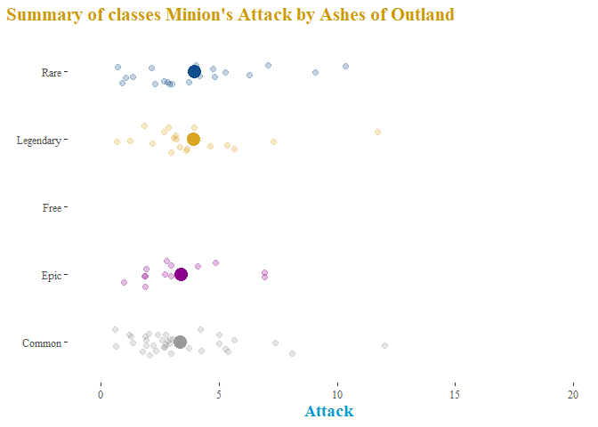

hearrthstone
================

PULL UP A CHAIR BY THE HEARTH\! Welcome to hearrthstone, the worlds
first ever (to my knowledge) R package that pulls data straight from the
Blizzard API for one of the most popular online card games in the world
today. For those of you that don’t know hearthstone is a card game
developed by the creators of World of Warcraft and set in the world of
Azeroth. The premise of the game is that heroes from the World of
Warcraft universe play in their spare time at the tavern. Using this
package you can explore how Hearthstone has changed over the last few
years. Which tribes have risen to popularity with new expansions? Which
classes have the best statted minions? What makes a legendary minion
different from regular rare and common minions? These questions and more
can be answered with the data you pull using the hearrthstone
package\!\!

To get started with the package we’re gonna need to install the
development version of the package from [Github](https://github.com/)
with:

## Installation

``` r
# install.packages("devtools")
devtools::install_github("kabhatia7/hearrthstone")
```

``` r
library(hearrthstone)
```

Unlike with other API packages such as ggmap, the user does not need to
specify an API key to access the package since the package automates
these processes, so after you install and load the package you’re all
set to go\!

## GET cards

#### get\_all\_cards()

The hearrthstone package uses GET requests to the Blizzard API in order
to output tidy data frames for us to use for our analysis. There are 4
main get card functions. The first one, `get_all_cards()` simply returns
a data frame all cards in the game, with a the parameters class and mana
cost since those are the only two variables that remain constant across
every card in hearthstone.

``` r
get_all_cards() %>% 
  head() 
```

    ##                   Name MinionType         hero Rarity manaCost
    ## 1    Aranna Starseeker       <NA> Demon Hunter   Free        0
    ## 2      Demonic Illidan       <NA> Demon Hunter   Free        0
    ## 3                 Blur       <NA> Demon Hunter Common        0
    ## 4           Twin Slice       <NA> Demon Hunter Common        0
    ## 5    Shadowhoof Slayer      Demon Demon Hunter   Free        1
    ## 6 Crimson Sigil Runner       <NA> Demon Hunter Common        1
    ##                 CardSet CardType attack health durability
    ## 1                  <NA>     Hero     NA     30         NA
    ## 2                  <NA>     Hero     NA     30         NA
    ## 3 Demon Hunter Initiate    Spell     NA     NA         NA
    ## 4 Demon Hunter Initiate    Spell     NA     NA         NA
    ## 5                 Basic   Minion      2      1         NA
    ## 6      Ashes of Outland   Minion      1      1         NA
    ##                                                                   text
    ## 1                                                                     
    ## 2                                                                     
    ## 3                               Your hero can't take damage this turn.
    ## 4 Give your hero +1 Attack this turn. Add 'Second Slice' to your hand.
    ## 5           <b>Battlecry:</b> Give your hero +1&nbsp;Attack this turn.
    ## 6                                         <b>Outcast:</b> Draw a card.
    ##   Text_length
    ## 1           0
    ## 2           0
    ## 3          38
    ## 4          68
    ## 5          58
    ## 6          28

The `get_all_cards()` function with no arguments simply returns every
card in the game. So if you’re familiar with data wrangling you could
pull all the cards in the game then filter based on whatever criteria
you wish from there. However, there are other functions so that you
would not have to do any data filtering and hopefully get the subset of
cards you wish for immediately. Let’s go over those now\!

#### get\_minions

Minions are the most fun and interesting parts about Hearthstone, every
card is so unique and using the `get_minions()` function you can easily
query either all the minion cards in the game or set specific filters
such as what class the card belongs to, its attack, health, and mana
cost. See the documentation for extensive details on how to most
effectively call the data you need.

``` r
minions <- get_minions() 

minions %>% 
  head()
```

    ##                   Name MinionType         hero Rarity manaCost
    ## 1    Shadowhoof Slayer      Demon Demon Hunter   Free        1
    ## 2 Crimson Sigil Runner       <NA> Demon Hunter Common        1
    ## 3          Battlefiend      Demon Demon Hunter Common        1
    ## 4        Ur'zul Horror      Demon Demon Hunter Common        1
    ## 5    Sightless Watcher      Demon Demon Hunter   Free        2
    ## 6       Furious Felfin     Murloc Demon Hunter   Rare        2
    ##                 CardSet attack health
    ## 1                 Basic      2      1
    ## 2      Ashes of Outland      1      1
    ## 3 Demon Hunter Initiate      1      2
    ## 4 Demon Hunter Initiate      2      1
    ## 5                 Basic      3      2
    ## 6      Ashes of Outland      3      2
    ##                                                                                 text
    ## 1                         <b>Battlecry:</b> Give your hero +1&nbsp;Attack this turn.
    ## 2                                                       <b>Outcast:</b> Draw a card.
    ## 3                                           After your hero attacks, gain +1 Attack.
    ## 4                              <b>Deathrattle:</b> Add a 2/1 Lost Soul to your hand.
    ## 5          <b>Battlecry:</b> Look at 3 cards in your deck. Choose one to put on top.
    ## 6 <b>Battlecry:</b> If your hero attacked this turn, gain +1 Attack and <b>Rush</b>.
    ##   Text_length
    ## 1          58
    ## 2          28
    ## 3          40
    ## 4          53
    ## 5          73
    ## 6          82

Now that we got the functions that get us data, lets go over some
functions that actually do something with it\!

### Plotting with hearrthstone

hearrthstone makes use of ggplot2 and a few add-on functions to provide
visual plots that will allow the user to make sense of and answer
questions that they may have using the API data.

#### Interactive Plots

``` r
plot_class_stats("attack")
```

    ## Warning: Ignoring unknown aesthetics: text

    ## PhantomJS not found. You can install it with webshot::install_phantomjs(). If it is installed, please make sure the phantomjs executable can be found via the PATH variable.

<!--html_preserve-->

<div id="htmlwidget-fd66288ed17c23ded247" class="plotly html-widget" style="width:672px;height:480px;">

</div>

<script type="application/json" data-for="htmlwidget-fd66288ed17c23ded247">{"x":{"data":[{"x":[1.74803884923458,0.639492017775774,0.80201109033078,1.92379437945783,3.02349065691233,3.38079246804118,2.01528183817863,4.24965545143932,3.3873522400856,3.16555138137192,2.61233560610563,4.18029434941709,4.73629064206034,3.71361322943121,6.34315564855933,2.17379501052201,8.00886221732944,10.2568137064576,5.63041564710438,9.22550030555576,5.24887250177562,6.65544701647013,8.31254645716399],"y":[1.10796061875299,1.08513589343056,0.921344080008566,1.04729454424232,0.820193496067077,0.817287521716207,1.12807048251852,0.803845798503607,0.840996601432562,1.04342887941748,1.10792721835896,1.06421698834747,0.886769734788686,0.878006998728961,1.07789103770629,1.05418118927628,0.827248050738126,1.08012594496831,0.94991810945794,0.987637700606138,0.962390010617673,1.03259925227612,1.17889431528747],"text":["Name: Shadowhoof Slayer <br> Class: Demon Hunter <br> Mana Cost: 1 <br> Card Set: Basic","Name: Crimson Sigil Runner <br> Class: Demon Hunter <br> Mana Cost: 1 <br> Card Set: Ashes of Outland","Name: Battlefiend <br> Class: Demon Hunter <br> Mana Cost: 1 <br> Card Set: Demon Hunter Initiate","Name: Ur'zul Horror <br> Class: Demon Hunter <br> Mana Cost: 1 <br> Card Set: Demon Hunter Initiate","Name: Sightless Watcher <br> Class: Demon Hunter <br> Mana Cost: 2 <br> Card Set: Basic","Name: Furious Felfin <br> Class: Demon Hunter <br> Mana Cost: 2 <br> Card Set: Ashes of Outland","Name: Netherwalker <br> Class: Demon Hunter <br> Mana Cost: 2 <br> Card Set: Ashes of Outland","Name: Satyr Overseer <br> Class: Demon Hunter <br> Mana Cost: 3 <br> Card Set: Basic","Name: Wrathscale Naga <br> Class: Demon Hunter <br> Mana Cost: 3 <br> Card Set: Demon Hunter Initiate","Name: Ashtongue Battlelord <br> Class: Demon Hunter <br> Mana Cost: 4 <br> Card Set: Ashes of Outland","Name: Kayn Sunfury <br> Class: Demon Hunter <br> Mana Cost: 4 <br> Card Set: Ashes of Outland","Name: Altruis the Outcast <br> Class: Demon Hunter <br> Mana Cost: 4 <br> Card Set: Demon Hunter Initiate","Name: Illidari Felblade <br> Class: Demon Hunter <br> Mana Cost: 4 <br> Card Set: Demon Hunter Initiate","Name: Raging Felscreamer <br> Class: Demon Hunter <br> Mana Cost: 4 <br> Card Set: Demon Hunter Initiate","Name: Glaivebound Adept <br> Class: Demon Hunter <br> Mana Cost: 5 <br> Card Set: Basic","Name: Wrathspike Brute <br> Class: Demon Hunter <br> Mana Cost: 5 <br> Card Set: Demon Hunter Initiate","Name: Fel Summoner <br> Class: Demon Hunter <br> Mana Cost: 6 <br> Card Set: Ashes of Outland","Name: Imprisoned Antaen <br> Class: Demon Hunter <br> Mana Cost: 6 <br> Card Set: Ashes of Outland","Name: Priestess of Fury <br> Class: Demon Hunter <br> Mana Cost: 7 <br> Card Set: Ashes of Outland","Name: Coilfang Warlord <br> Class: Demon Hunter <br> Mana Cost: 8 <br> Card Set: Ashes of Outland","Name: Hulking Overfiend <br> Class: Demon Hunter <br> Mana Cost: 8 <br> Card Set: Demon Hunter Initiate","Name: Pit Commander <br> Class: Demon Hunter <br> Mana Cost: 9 <br> Card Set: Ashes of Outland","Name: Nethrandamus <br> Class: Demon Hunter <br> Mana Cost: 9 <br> Card Set: Demon Hunter Initiate"],"type":"scatter","mode":"markers","marker":{"autocolorscale":false,"color":"rgba(0,205,0,1)","opacity":0.25,"size":7.55905511811024,"symbol":"circle","line":{"width":1.88976377952756,"color":"rgba(0,205,0,1)"}},"hoveron":"points","name":"Demon Hunter","legendgroup":"Demon Hunter","showlegend":true,"xaxis":"x","yaxis":"y","hoverinfo":"text","frame":null},{"x":[1.11509164310992,2.15168425124139,0.288630604743958,2.24158952813596,1.8940740596503,1.80895001329482,2.11673640254885,2.34459671396762,1.1892490953207,2.08203943800181,2.32693412005901,1.72589686773717,0.949898030795157,0.902391420863569,1.96346790976822,2.09806648157537,2.27108303308487,2.95884367339313,2.36792681105435,2.75976191144437,5.1995701584965,1.06233762968332,3.12038806471974,1.7403972953558,1.12546204570681,2.22808356042951,2.8867189174518,2.6202277271077,1.60731789842248,4.96980499662459,4.10765714943409,3.74097775518894,2.84612525030971,4.21202129852027,2.99074768666178,2.83552100416273,2.07091602943838,3.23971457779408,2.64388257730752,1.24647552035749,2.74142187424004,1.90130461025983,4.38115323465317,1.61940675023943,3.83682165499777,3.72212284710258,4.62889856956899,4.80186669491231,2.35444258432835,3.61738424245268,3.17560706008226,3.60277677625418,4.17746404223144,2.8255568139255,4.75581421814859,3.20915963556617,6.81504214759916,5.07140547335148,4.80592962689698,2.65656735543162,3.05575425215065,4.30310004688799,4.91926649212837,5.1690193515271,9.07433083783835,6.27429977282882,4.97211681641638,4.11630415432155,4.22450556326658,3.69464029073715,7.28808756954968,4.74049770217389,5.65018278192729,6.67002421114594,8.32670280914754,3.25440100375563,8.03732205685228,4.15084397252649,5.03712344542146,6.8886500177905,3.18463506102562,8.27591841556132,3.84435394965112,5.09351040385664,4.81242243237793,6.73473812453449,12.2404452782124],"y":[1.86840768549591,1.85274748047814,1.80441308608279,2.03700343612581,2.17932356335223,2.04962250767276,1.98224781928584,2.05783802047372,1.803701322712,2.12396659487858,1.86812071753666,1.8154013668187,1.83438082132488,1.94871445391327,1.97850417951122,1.80472436137497,2.11305572409183,2.04495704825968,1.90290154311806,2.13343392340466,2.06846169261262,2.12284519271925,1.99794806055725,2.16636767508462,2.17220496851951,1.88378823651001,1.87971862461418,1.92170876301825,1.83493609782308,1.81424714606255,1.93857548385859,2.00648182211444,1.94930558726192,2.19832228645682,2.16647578990087,1.82121889833361,1.81988121168688,1.87000309498981,1.88646136336029,2.09431154569611,1.92334568444639,2.1106399115175,2.19336895626038,1.92178301010281,1.83386344723403,2.13672234583646,2.03825453147292,1.94028580170125,1.85358318882063,1.92665287507698,1.86196610415354,2.0401329793036,2.19757500067353,1.84892600998282,2.006294886861,1.93228604784235,2.10404308009893,1.81693666623905,2.16758718146011,2.18309979159385,1.90066259354353,2.01468503912911,1.86297638658434,2.0116570552811,2.04136146595702,2.09558470156044,1.92798596359789,2.03266165461391,2.09086207132786,2.12239518407732,1.88031723508611,2.02223284412175,2.12790229218081,1.96391450986266,2.16998971831053,1.94981972295791,2.16717587281018,1.99155476596206,2.11687168106437,1.96262470697984,2.13428945811465,1.94707813560963,2.05662409607321,1.88999164542183,2.02928176233545,1.87778225280344,1.82055002851412],"text":["Name: Forbidden Ancient <br> Class: Druid <br> Mana Cost: 1 <br> Card Set: Whispers of the Old Gods","Name: Enchanted Raven <br> Class: Druid <br> Mana Cost: 1 <br> Card Set: One Night in Karazhan","Name: Spirit of the Raptor <br> Class: Druid <br> Mana Cost: 1 <br> Card Set: Rastakhan's Rumble","Name: Acornbearer <br> Class: Druid <br> Mana Cost: 1 <br> Card Set: Rise of Shadows","Name: Anodized Robo Cub <br> Class: Druid <br> Mana Cost: 2 <br> Card Set: Goblins vs Gnomes","Name: Darnassus Aspirant <br> Class: Druid <br> Mana Cost: 2 <br> Card Set: The Grand Tournament","Name: Druid of the Saber <br> Class: Druid <br> Mana Cost: 2 <br> Card Set: The Grand Tournament","Name: Tortollan Forager <br> Class: Druid <br> Mana Cost: 2 <br> Card Set: Journey to Un'Goro","Name: Druid of the Swarm <br> Class: Druid <br> Mana Cost: 2 <br> Card Set: Knights of the Frozen Throne","Name: Dendrologist <br> Class: Druid <br> Mana Cost: 2 <br> Card Set: The Boomsday Project","Name: Savage Striker <br> Class: Druid <br> Mana Cost: 2 <br> Card Set: Rastakhan's Rumble","Name: Keeper Stalladris <br> Class: Druid <br> Mana Cost: 2 <br> Card Set: Rise of Shadows","Name: Crystal Merchant <br> Class: Druid <br> Mana Cost: 2 <br> Card Set: Saviors of Uldum","Name: Shrubadier <br> Class: Druid <br> Mana Cost: 2 <br> Card Set: Descent of Dragons","Name: Steel Beetle <br> Class: Druid <br> Mana Cost: 2 <br> Card Set: Galakrond's Awakening","Name: Grove Tender <br> Class: Druid <br> Mana Cost: 3 <br> Card Set: Goblins vs Gnomes","Name: Druid of the Flame <br> Class: Druid <br> Mana Cost: 3 <br> Card Set: Blackrock Mountain","Name: Mounted Raptor <br> Class: Druid <br> Mana Cost: 3 <br> Card Set: League of Explorers","Name: Addled Grizzly <br> Class: Druid <br> Mana Cost: 3 <br> Card Set: Whispers of the Old Gods","Name: Celestial Dreamer <br> Class: Druid <br> Mana Cost: 3 <br> Card Set: Mean Streets of Gadgetzan","Name: Elder Longneck <br> Class: Druid <br> Mana Cost: 3 <br> Card Set: Journey to Un'Goro","Name: Crypt Lord <br> Class: Druid <br> Mana Cost: 3 <br> Card Set: Knights of the Frozen Throne","Name: Greedy Sprite <br> Class: Druid <br> Mana Cost: 3 <br> Card Set: Kobolds and Catacombs","Name: Druid of the Scythe <br> Class: Druid <br> Mana Cost: 3 <br> Card Set: The Witchwood","Name: Wardruid Loti <br> Class: Druid <br> Mana Cost: 3 <br> Card Set: Rastakhan's Rumble","Name: Lifeweaver <br> Class: Druid <br> Mana Cost: 3 <br> Card Set: Rise of Shadows","Name: Archspore Msshi'fn <br> Class: Druid <br> Mana Cost: 3 <br> Card Set: Ashes of Outland","Name: Imprisoned Satyr <br> Class: Druid <br> Mana Cost: 3 <br> Card Set: Ashes of Outland","Name: Keeper of the Grove <br> Class: Druid <br> Mana Cost: 4 <br> Card Set: Classic","Name: Savage Combatant <br> Class: Druid <br> Mana Cost: 4 <br> Card Set: The Grand Tournament","Name: Wildwalker <br> Class: Druid <br> Mana Cost: 4 <br> Card Set: The Grand Tournament","Name: Jungle Moonkin <br> Class: Druid <br> Mana Cost: 4 <br> Card Set: League of Explorers","Name: Fandral Staghelm <br> Class: Druid <br> Mana Cost: 4 <br> Card Set: Whispers of the Old Gods","Name: Klaxxi Amber-Weaver <br> Class: Druid <br> Mana Cost: 4 <br> Card Set: Whispers of the Old Gods","Name: Mire Keeper <br> Class: Druid <br> Mana Cost: 4 <br> Card Set: Whispers of the Old Gods","Name: Shellshifter <br> Class: Druid <br> Mana Cost: 4 <br> Card Set: Journey to Un'Goro","Name: Strongshell Scavenger <br> Class: Druid <br> Mana Cost: 4 <br> Card Set: Knights of the Frozen Throne","Name: Astral Tiger <br> Class: Druid <br> Mana Cost: 4 <br> Card Set: Kobolds and Catacombs","Name: Ironwood Golem <br> Class: Druid <br> Mana Cost: 4 <br> Card Set: Kobolds and Catacombs","Name: Forest Guide <br> Class: Druid <br> Mana Cost: 4 <br> Card Set: The Witchwood","Name: Flobbidinous Floop <br> Class: Druid <br> Mana Cost: 4 <br> Card Set: The Boomsday Project","Name: Garden Gnome <br> Class: Druid <br> Mana Cost: 4 <br> Card Set: Saviors of Uldum","Name: Druid of the Claw <br> Class: Druid <br> Mana Cost: 5 <br> Card Set: Classic","Name: Gloom Stag <br> Class: Druid <br> Mana Cost: 5 <br> Card Set: Hall of Fame","Name: Druid of the Fang <br> Class: Druid <br> Mana Cost: 5 <br> Card Set: Goblins vs Gnomes","Name: Virmen Sensei <br> Class: Druid <br> Mana Cost: 5 <br> Card Set: Mean Streets of Gadgetzan","Name: Verdant Longneck <br> Class: Druid <br> Mana Cost: 5 <br> Card Set: Journey to Un'Goro","Name: Fatespinner <br> Class: Druid <br> Mana Cost: 5 <br> Card Set: Knights of the Frozen Throne","Name: Ixlid, Fungal Lord <br> Class: Druid <br> Mana Cost: 5 <br> Card Set: Kobolds and Catacombs","Name: Bewitched Guardian <br> Class: Druid <br> Mana Cost: 5 <br> Card Set: The Witchwood","Name: Duskfallen Aviana <br> Class: Druid <br> Mana Cost: 5 <br> Card Set: The Witchwood","Name: Treespeaker <br> Class: Druid <br> Mana Cost: 5 <br> Card Set: Rastakhan's Rumble","Name: Crystal Stag <br> Class: Druid <br> Mana Cost: 5 <br> Card Set: Rise of Shadows","Name: Anubisath Defender <br> Class: Druid <br> Mana Cost: 5 <br> Card Set: Saviors of Uldum","Name: Elise the Enlightened <br> Class: Druid <br> Mana Cost: 5 <br> Card Set: Saviors of Uldum","Name: Oasis Surger <br> Class: Druid <br> Mana Cost: 5 <br> Card Set: Saviors of Uldum","Name: Mech-Bear-Cat <br> Class: Druid <br> Mana Cost: 6 <br> Card Set: Goblins vs Gnomes","Name: Dark Arakkoa <br> Class: Druid <br> Mana Cost: 6 <br> Card Set: Whispers of the Old Gods","Name: Menagerie Warden <br> Class: Druid <br> Mana Cost: 6 <br> Card Set: One Night in Karazhan","Name: Jade Behemoth <br> Class: Druid <br> Mana Cost: 6 <br> Card Set: Mean Streets of Gadgetzan","Name: Tending Tauren <br> Class: Druid <br> Mana Cost: 6 <br> Card Set: The Boomsday Project","Name: Emerald Explorer <br> Class: Druid <br> Mana Cost: 6 <br> Card Set: Descent of Dragons","Name: Ancient of Lore <br> Class: Druid <br> Mana Cost: 7 <br> Card Set: Classic","Name: Ancient of War <br> Class: Druid <br> Mana Cost: 7 <br> Card Set: Classic","Name: Malorne <br> Class: Druid <br> Mana Cost: 7 <br> Card Set: Goblins vs Gnomes","Name: Knight of the Wild <br> Class: Druid <br> Mana Cost: 7 <br> Card Set: The Grand Tournament","Name: Giant Anaconda <br> Class: Druid <br> Mana Cost: 7 <br> Card Set: Journey to Un'Goro","Name: Dreampetal Florist <br> Class: Druid <br> Mana Cost: 7 <br> Card Set: The Boomsday Project","Name: Gloop Sprayer <br> Class: Druid <br> Mana Cost: 7 <br> Card Set: The Boomsday Project","Name: Gonk, the Raptor <br> Class: Druid <br> Mana Cost: 7 <br> Card Set: Rastakhan's Rumble","Name: Ironhide Direhorn <br> Class: Druid <br> Mana Cost: 7 <br> Card Set: Rastakhan's Rumble","Name: Goru the Mightree <br> Class: Druid <br> Mana Cost: 7 <br> Card Set: Descent of Dragons","Name: Winged Guardian <br> Class: Druid <br> Mana Cost: 7 <br> Card Set: Galakrond's Awakening","Name: Marsh Hydra <br> Class: Druid <br> Mana Cost: 7 <br> Card Set: Ashes of Outland","Name: Ironbark Protector <br> Class: Druid <br> Mana Cost: 8 <br> Card Set: Basic","Name: Grizzled Guardian <br> Class: Druid <br> Mana Cost: 8 <br> Card Set: Kobolds and Catacombs","Name: Splintergraft <br> Class: Druid <br> Mana Cost: 8 <br> Card Set: The Witchwood","Name: Lucentbark <br> Class: Druid <br> Mana Cost: 8 <br> Card Set: Rise of Shadows","Name: Cenarius <br> Class: Druid <br> Mana Cost: 9 <br> Card Set: Classic","Name: Volcanic Lumberer <br> Class: Druid <br> Mana Cost: 9 <br> Card Set: Blackrock Mountain","Name: Hadronox <br> Class: Druid <br> Mana Cost: 9 <br> Card Set: Knights of the Frozen Throne","Name: Mulchmuncher <br> Class: Druid <br> Mana Cost: 9 <br> Card Set: The Boomsday Project","Name: Ysera, Unleashed <br> Class: Druid <br> Mana Cost: 9 <br> Card Set: Descent of Dragons","Name: Ysiel Windsinger <br> Class: Druid <br> Mana Cost: 9 <br> Card Set: Ashes of Outland","Name: Aviana <br> Class: Druid <br> Mana Cost: 10 <br> Card Set: The Grand Tournament","Name: Kun the Forgotten King <br> Class: Druid <br> Mana Cost: 10 <br> Card Set: Mean Streets of Gadgetzan","Name: Tyrantus <br> Class: Druid <br> Mana Cost: 10 <br> Card Set: Journey to Un'Goro"],"type":"scatter","mode":"markers","marker":{"autocolorscale":false,"color":"rgba(238,154,0,1)","opacity":0.25,"size":7.55905511811024,"symbol":"circle","line":{"width":1.88976377952756,"color":"rgba(238,154,0,1)"}},"hoveron":"points","name":"Druid","legendgroup":"Druid","showlegend":true,"xaxis":"x","yaxis":"y","hoverinfo":"text","frame":null},{"x":[1.24456359408796,1.21217882037163,2.1287000419572,1.83760175984353,1.16854681894183,1.16059491224587,1.95975745245814,0.85136726796627,0.89960471354425,1.33777068536729,1.94952264465392,1.9804158737883,2.39799867793918,2.66226702854037,1.25116975400597,2.87032896988094,3.16245987340808,1.9108538499102,1.94858226533979,1.92734819315374,2.37080857753754,4.99275924637914,2.79693425465375,4.2730697279796,3.63060472942889,1.88151510357857,1.84621565993875,4.00395078454167,2.9615371497348,2.39858283679932,3.23076328970492,2.69607980251312,4.03172952439636,1.9859351111576,2.18876966573298,1.68209081888199,2.11399413589388,1.94140094574541,0.39955870360136,2.98072649687529,3.72419462054968,4.13624051883817,1.79022740460932,2.13380360752344,2.37334093544632,1.90971106570214,3.66898830085993,4.00787976440042,2.87190546896309,1.76950796078891,1.75846137199551,4.87965858690441,3.0073256097734,1.62342607025057,3.34777696318924,2.94002525433898,2.68716991581023,2.66465296652168,4.65715764369816,3.15886981952935,1.82441866993904,2.17172122951597,3.17093319632113,5.89587281029671,2.84118074886501,2.67986489143223,4.16400195397437,2.73974027037621,1.07125438973308,3.04088988844305,5.64788972139359,6.15322113707662,4.9255125368014,2.9209539918229,5.29303180910647,6.02700130324811,6.94872122276574,6.20493001416326,4.21908209472895,8.94096535183489,5.66379570029676,5.33212407324463,4.81282884087414,1.82564434669912,8.21923199519515,6.29839604031295,4.96931925844401,8.00877109002322,8.35879964064807],"y":[2.91954630566761,3.18854507450014,2.88590938132256,3.01908195661381,3.13152839317918,3.18483669264242,3.00456453673542,2.94808764904737,3.11753257131204,2.82340867640451,2.86340981107205,3.1940117077902,2.88940819073468,2.82882849927992,3.06862645093352,3.15318188136443,3.18358198124915,3.15994605077431,2.88764395145699,2.87823804430664,2.84739643251523,2.8644292537123,2.95069987457246,2.96072561573237,2.93880239855498,2.92088723257184,3.08489096621051,2.97550318082795,2.96055723978206,2.93903660634533,3.09610264832154,2.88596155261621,3.08900549281389,3.07220163736492,2.95523694939911,3.07376568587497,3.16441153241321,2.95479145739228,3.19649445777759,2.89300590744242,3.02206855984405,2.80179587276652,2.88140588682145,2.95206280546263,2.98042709287256,2.9369726090692,3.07411063062027,3.14193542515859,2.97136942073703,3.0547542004846,2.85690406784415,3.03654223233461,2.98875099085271,2.97425719816238,3.16049389978871,3.04136340506375,2.976119572483,2.96258513592184,2.91609386373311,2.96770012332126,2.90427491404116,3.01849586926401,2.9611838074401,3.16012815441936,2.9991533594206,3.03564886394888,2.9419207287021,2.95915942993015,3.15067299231887,2.88282864484936,3.0996156909503,3.06807350236922,2.90109891239554,3.01919562639669,2.88304384443909,2.93256321987137,2.95245633646846,2.91907599149272,2.96056241253391,3.02111682714894,2.99536154195666,3.15034088687971,3.00408909674734,3.01533375987783,2.88963930411264,3.0795737429522,2.9070710289292,3.04608553657308,2.90614538174123],"text":["Name: Timber Wolf <br> Class: Hunter <br> Mana Cost: 1 <br> Card Set: Basic","Name: Webspinner <br> Class: Hunter <br> Mana Cost: 1 <br> Card Set: Curse of Naxxramas","Name: Brave Archer <br> Class: Hunter <br> Mana Cost: 1 <br> Card Set: The Grand Tournament","Name: Fiery Bat <br> Class: Hunter <br> Mana Cost: 1 <br> Card Set: Whispers of the Old Gods","Name: Alleycat <br> Class: Hunter <br> Mana Cost: 1 <br> Card Set: Mean Streets of Gadgetzan","Name: Jeweled Macaw <br> Class: Hunter <br> Mana Cost: 1 <br> Card Set: Journey to Un'Goro","Name: Raptor Hatchling <br> Class: Hunter <br> Mana Cost: 1 <br> Card Set: Journey to Un'Goro","Name: Springpaw <br> Class: Hunter <br> Mana Cost: 1 <br> Card Set: Rastakhan's Rumble","Name: Shimmerfly <br> Class: Hunter <br> Mana Cost: 1 <br> Card Set: Rise of Shadows","Name: Dwarven Sharpshooter <br> Class: Hunter <br> Mana Cost: 1 <br> Card Set: Descent of Dragons","Name: Helboar <br> Class: Hunter <br> Mana Cost: 1 <br> Card Set: Ashes of Outland","Name: Scavenging Hyena <br> Class: Hunter <br> Mana Cost: 2 <br> Card Set: Classic","Name: Steamwheedle Sniper <br> Class: Hunter <br> Mana Cost: 2 <br> Card Set: Goblins vs Gnomes","Name: King's Elekk <br> Class: Hunter <br> Mana Cost: 2 <br> Card Set: The Grand Tournament","Name: Kindly Grandmother <br> Class: Hunter <br> Mana Cost: 2 <br> Card Set: One Night in Karazhan","Name: Trogg Beastrager <br> Class: Hunter <br> Mana Cost: 2 <br> Card Set: Mean Streets of Gadgetzan","Name: Crackling Razormaw <br> Class: Hunter <br> Mana Cost: 2 <br> Card Set: Journey to Un'Goro","Name: Hunting Mastiff <br> Class: Hunter <br> Mana Cost: 2 <br> Card Set: The Witchwood","Name: Fireworks Tech <br> Class: Hunter <br> Mana Cost: 2 <br> Card Set: The Boomsday Project","Name: Venomizer <br> Class: Hunter <br> Mana Cost: 2 <br> Card Set: The Boomsday Project","Name: Phase Stalker <br> Class: Hunter <br> Mana Cost: 2 <br> Card Set: Descent of Dragons","Name: Imprisoned Felmaw <br> Class: Hunter <br> Mana Cost: 2 <br> Card Set: Ashes of Outland","Name: Metaltooth Leaper <br> Class: Hunter <br> Mana Cost: 3 <br> Card Set: Goblins vs Gnomes","Name: Dreadscale <br> Class: Hunter <br> Mana Cost: 3 <br> Card Set: The Grand Tournament","Name: Stablemaster <br> Class: Hunter <br> Mana Cost: 3 <br> Card Set: The Grand Tournament","Name: Desert Camel <br> Class: Hunter <br> Mana Cost: 3 <br> Card Set: League of Explorers","Name: Carrion Grub <br> Class: Hunter <br> Mana Cost: 3 <br> Card Set: Whispers of the Old Gods","Name: Forlorn Stalker <br> Class: Hunter <br> Mana Cost: 3 <br> Card Set: Whispers of the Old Gods","Name: Cloaked Huntress <br> Class: Hunter <br> Mana Cost: 3 <br> Card Set: One Night in Karazhan","Name: Rat Pack <br> Class: Hunter <br> Mana Cost: 3 <br> Card Set: Mean Streets of Gadgetzan","Name: Shaky Zipgunner <br> Class: Hunter <br> Mana Cost: 3 <br> Card Set: Mean Streets of Gadgetzan","Name: Terrorscale Stalker <br> Class: Hunter <br> Mana Cost: 3 <br> Card Set: Journey to Un'Goro","Name: Bearshark <br> Class: Hunter <br> Mana Cost: 3 <br> Card Set: Knights of the Frozen Throne","Name: Stitched Tracker <br> Class: Hunter <br> Mana Cost: 3 <br> Card Set: Knights of the Frozen Throne","Name: Cave Hydra <br> Class: Hunter <br> Mana Cost: 3 <br> Card Set: Kobolds and Catacombs","Name: Duskhaven Hunter <br> Class: Hunter <br> Mana Cost: 3 <br> Card Set: The Witchwood","Name: Spider Bomb <br> Class: Hunter <br> Mana Cost: 3 <br> Card Set: The Boomsday Project","Name: Bloodscalp Strategist <br> Class: Hunter <br> Mana Cost: 3 <br> Card Set: Rastakhan's Rumble","Name: Spirit of the Lynx <br> Class: Hunter <br> Mana Cost: 3 <br> Card Set: Rastakhan's Rumble","Name: Ursatron <br> Class: Hunter <br> Mana Cost: 3 <br> Card Set: Rise of Shadows","Name: Ramkahen Wildtamer <br> Class: Hunter <br> Mana Cost: 3 <br> Card Set: Saviors of Uldum","Name: Diving Gryphon <br> Class: Hunter <br> Mana Cost: 3 <br> Card Set: Descent of Dragons","Name: Primordial Explorer <br> Class: Hunter <br> Mana Cost: 3 <br> Card Set: Descent of Dragons","Name: Chopshop Copter <br> Class: Hunter <br> Mana Cost: 3 <br> Card Set: Galakrond's Awakening","Name: Augmented Porcupine <br> Class: Hunter <br> Mana Cost: 3 <br> Card Set: Ashes of Outland","Name: Zixor, Apex Predator <br> Class: Hunter <br> Mana Cost: 3 <br> Card Set: Ashes of Outland","Name: Houndmaster <br> Class: Hunter <br> Mana Cost: 4 <br> Card Set: Basic","Name: Core Rager <br> Class: Hunter <br> Mana Cost: 4 <br> Card Set: Blackrock Mountain","Name: Infested Wolf <br> Class: Hunter <br> Mana Cost: 4 <br> Card Set: Whispers of the Old Gods","Name: Dispatch Kodo <br> Class: Hunter <br> Mana Cost: 4 <br> Card Set: Mean Streets of Gadgetzan","Name: Exploding Bloatbat <br> Class: Hunter <br> Mana Cost: 4 <br> Card Set: Knights of the Frozen Throne","Name: Professor Putricide <br> Class: Hunter <br> Mana Cost: 4 <br> Card Set: Knights of the Frozen Throne","Name: Houndmaster Shaw <br> Class: Hunter <br> Mana Cost: 4 <br> Card Set: The Witchwood","Name: Toxmonger <br> Class: Hunter <br> Mana Cost: 4 <br> Card Set: The Witchwood","Name: Necromechanic <br> Class: Hunter <br> Mana Cost: 4 <br> Card Set: The Boomsday Project","Name: Arcane Fletcher <br> Class: Hunter <br> Mana Cost: 4 <br> Card Set: Rise of Shadows","Name: Hyena Alpha <br> Class: Hunter <br> Mana Cost: 4 <br> Card Set: Saviors of Uldum","Name: Dragonbane <br> Class: Hunter <br> Mana Cost: 4 <br> Card Set: Descent of Dragons","Name: Mok'Nathal Lion <br> Class: Hunter <br> Mana Cost: 4 <br> Card Set: Ashes of Outland","Name: Starving Buzzard <br> Class: Hunter <br> Mana Cost: 5 <br> Card Set: Basic","Name: Tundra Rhino <br> Class: Hunter <br> Mana Cost: 5 <br> Card Set: Basic","Name: King of Beasts <br> Class: Hunter <br> Mana Cost: 5 <br> Card Set: Goblins vs Gnomes","Name: Ram Wrangler <br> Class: Hunter <br> Mana Cost: 5 <br> Card Set: The Grand Tournament","Name: Princess Huhuran <br> Class: Hunter <br> Mana Cost: 5 <br> Card Set: Whispers of the Old Gods","Name: Knuckles <br> Class: Hunter <br> Mana Cost: 5 <br> Card Set: Mean Streets of Gadgetzan","Name: Tol'vir Warden <br> Class: Hunter <br> Mana Cost: 5 <br> Card Set: Journey to Un'Goro","Name: Corpse Widow <br> Class: Hunter <br> Mana Cost: 5 <br> Card Set: Knights of the Frozen Throne","Name: Carrion Drake <br> Class: Hunter <br> Mana Cost: 5 <br> Card Set: The Witchwood","Name: Vilebrood Skitterer <br> Class: Hunter <br> Mana Cost: 5 <br> Card Set: The Witchwood","Name: Halazzi, the Lynx <br> Class: Hunter <br> Mana Cost: 5 <br> Card Set: Rastakhan's Rumble","Name: Rotnest Drake <br> Class: Hunter <br> Mana Cost: 5 <br> Card Set: Galakrond's Awakening","Name: Savannah Highmane <br> Class: Hunter <br> Mana Cost: 6 <br> Card Set: Classic","Name: Seeping Oozeling <br> Class: Hunter <br> Mana Cost: 6 <br> Card Set: Kobolds and Catacombs","Name: Oblivitron <br> Class: Hunter <br> Mana Cost: 6 <br> Card Set: Rise of Shadows","Name: Scarlet Webweaver <br> Class: Hunter <br> Mana Cost: 6 <br> Card Set: Saviors of Uldum","Name: Wild Bloodstinger <br> Class: Hunter <br> Mana Cost: 6 <br> Card Set: Saviors of Uldum","Name: Veranus <br> Class: Hunter <br> Mana Cost: 6 <br> Card Set: Descent of Dragons","Name: Gahz'rilla <br> Class: Hunter <br> Mana Cost: 7 <br> Card Set: Goblins vs Gnomes","Name: Acidmaw <br> Class: Hunter <br> Mana Cost: 7 <br> Card Set: The Grand Tournament","Name: Swamp King Dred <br> Class: Hunter <br> Mana Cost: 7 <br> Card Set: Journey to Un'Goro","Name: Abominable Bowman <br> Class: Hunter <br> Mana Cost: 7 <br> Card Set: Knights of the Frozen Throne","Name: Boommaster Flark <br> Class: Hunter <br> Mana Cost: 7 <br> Card Set: The Boomsday Project","Name: Vereesa Windrunner <br> Class: Hunter <br> Mana Cost: 7 <br> Card Set: Rise of Shadows","Name: Dinotamer Brann <br> Class: Hunter <br> Mana Cost: 7 <br> Card Set: Saviors of Uldum","Name: Giant Sand Worm <br> Class: Hunter <br> Mana Cost: 8 <br> Card Set: Whispers of the Old Gods","Name: Kathrena Winterwisp <br> Class: Hunter <br> Mana Cost: 8 <br> Card Set: Kobolds and Catacombs","Name: Beastmaster Leoroxx <br> Class: Hunter <br> Mana Cost: 8 <br> Card Set: Ashes of Outland","Name: King Krush <br> Class: Hunter <br> Mana Cost: 9 <br> Card Set: Classic","Name: Emeriss <br> Class: Hunter <br> Mana Cost: 10 <br> Card Set: The Witchwood"],"type":"scatter","mode":"markers","marker":{"autocolorscale":false,"color":"rgba(34,139,34,1)","opacity":0.25,"size":7.55905511811024,"symbol":"circle","line":{"width":1.88976377952756,"color":"rgba(34,139,34,1)"}},"hoveron":"points","name":"Hunter","legendgroup":"Hunter","showlegend":true,"xaxis":"x","yaxis":"y","hoverinfo":"text","frame":null},{"x":[1.34698811415583,1.7007429279387,1.13950846474618,1.2594053382054,0.667660578899085,0.88640266302973,3.2876756420359,1.75135662704706,3.21543557364494,2.67731869071722,2.16598212942481,1.89212188646197,1.87795868869871,2.32283231560141,1.00653563663363,2.02177166808397,1.7857523413375,1.75420366860926,-0.377728907205164,2.38568347040564,1.20382098462433,2.26025706268847,2.61022207085043,2.39815741442144,2.64848715383559,2.71014020238072,3.98158963173628,2.94073721840978,2.92525346409529,1.66531882416457,3.25942720007151,2.0977332515642,3.17666595093906,2.63250813707709,2.64564597774297,2.28143074568361,3.12102131918073,2.80623983033001,3.35991640686989,1.86344168074429,1.64510712716728,3.87794964127243,3.3701888255775,2.866528894566,4.82996762208641,2.17364833559841,3.1741061354056,4.09716470502317,2.19246274270117,4.80996801294386,1.98180660419166,4.33720730859786,1.91305120624602,2.61577082574368,4.10599859207869,3.17930811308324,2.1684933995828,5.86965344343334,4.76342537570745,5.24200912248343,4.8802216861397,3.73267520982772,3.60292886365205,5.36714665535837,2.20329337585717,6.05035074073821,4.75758653990924,5.01704746037722,4.60501239504665,3.06562189459801,2.68143135868013,4.29500509072095,3.62653603646904,4.73148070499301,7.36237370651215,4.95287251155824,4.64652165081352,3.71205714922398,7.02792169488967,7.14753683395684,7.96328559406102,8.20477217081934,4.80450626574457,5.39902126099914,7.79694510232657,3.22714735865593,3.84843240194023],"y":[3.87634588489309,3.87961656386033,4.05553510496393,4.12181352777407,4.17383369579911,3.89884473728016,4.13665152415633,3.99829343110323,4.09941392736509,3.83205397138372,3.83730678753927,4.16720198867843,4.05012079589069,4.07917879661545,3.86853039544076,4.07133324425668,4.05205297050998,4.0829991559498,3.97547991378233,3.80166255021468,3.88267486291006,3.85970071619377,4.10618028547615,3.97833603639156,3.80796533748507,3.9240790547803,4.06734674777836,3.88510038228706,4.05429394757375,4.1556809826754,3.95090297246352,3.87455670945346,3.99869564808905,3.99397276313975,4.06604540264234,3.94486066298559,4.14628334445879,3.8080488675274,3.9698573439382,3.85994058148935,3.83155565233901,4.08876842195168,4.18303823852912,4.11643853113055,4.12677861200646,3.80184930628166,4.06935776500031,3.819439976383,4.01421565702185,4.03877763152123,4.01638452913612,4.09516496136785,3.83161731082946,3.8959016636014,4.17119259182364,3.94443802135065,3.92217604219913,3.89132942901924,3.92906122291461,3.86369109675288,3.94105096384883,4.1383656074293,3.95380548276007,4.15550108142197,4.05430377228186,4.19437806438655,4.00552601534873,4.14561542281881,3.90175182921812,4.0300135939382,3.91253694165498,3.82464404888451,3.99303966965526,3.96851769378409,3.86114155147225,4.10636971490458,3.86836954401806,4.17380090383813,3.90109025128186,3.98136102221906,3.86215707259253,3.96475822553039,3.94036525739357,4.09096793103963,4.03670345190912,4.12034964589402,4.02974042417482],"text":["Name: Babbling Book <br> Class: Mage <br> Mana Cost: 1 <br> Card Set: One Night in Karazhan","Name: Kabal Lackey <br> Class: Mage <br> Mana Cost: 1 <br> Card Set: Mean Streets of Gadgetzan","Name: Arcane Artificer <br> Class: Mage <br> Mana Cost: 1 <br> Card Set: Kobolds and Catacombs","Name: Daring Fire-Eater <br> Class: Mage <br> Mana Cost: 1 <br> Card Set: Rastakhan's Rumble","Name: Violet Spellwing <br> Class: Mage <br> Mana Cost: 1 <br> Card Set: Descent of Dragons","Name: Mana Wyrm <br> Class: Mage <br> Mana Cost: 2 <br> Card Set: Classic","Name: Sorcerer's Apprentice <br> Class: Mage <br> Mana Cost: 2 <br> Card Set: Classic","Name: Snowchugger <br> Class: Mage <br> Mana Cost: 2 <br> Card Set: Goblins vs Gnomes","Name: Fallen Hero <br> Class: Mage <br> Mana Cost: 2 <br> Card Set: The Grand Tournament","Name: Cult Sorcerer <br> Class: Mage <br> Mana Cost: 2 <br> Card Set: Whispers of the Old Gods","Name: Medivh's Valet <br> Class: Mage <br> Mana Cost: 2 <br> Card Set: One Night in Karazhan","Name: Arcanologist <br> Class: Mage <br> Mana Cost: 2 <br> Card Set: Journey to Un'Goro","Name: Pyros <br> Class: Mage <br> Mana Cost: 2 <br> Card Set: Journey to Un'Goro","Name: Shimmering Tempest <br> Class: Mage <br> Mana Cost: 2 <br> Card Set: Journey to Un'Goro","Name: Ice Walker <br> Class: Mage <br> Mana Cost: 2 <br> Card Set: Knights of the Frozen Throne","Name: Raven Familiar <br> Class: Mage <br> Mana Cost: 2 <br> Card Set: Kobolds and Catacombs","Name: Archmage Arugal <br> Class: Mage <br> Mana Cost: 2 <br> Card Set: The Witchwood","Name: Celestial Emissary <br> Class: Mage <br> Mana Cost: 2 <br> Card Set: The Boomsday Project","Name: Spirit of the Dragonhawk <br> Class: Mage <br> Mana Cost: 2 <br> Card Set: Rastakhan's Rumble","Name: Khadgar <br> Class: Mage <br> Mana Cost: 2 <br> Card Set: Rise of Shadows","Name: Magic Dart Frog <br> Class: Mage <br> Mana Cost: 2 <br> Card Set: Rise of Shadows","Name: Mana Cyclone <br> Class: Mage <br> Mana Cost: 2 <br> Card Set: Rise of Shadows","Name: Arcane Flakmage <br> Class: Mage <br> Mana Cost: 2 <br> Card Set: Saviors of Uldum","Name: Apexis Smuggler <br> Class: Mage <br> Mana Cost: 2 <br> Card Set: Ashes of Outland","Name: Astromancer Solarian <br> Class: Mage <br> Mana Cost: 2 <br> Card Set: Ashes of Outland","Name: Starscryer <br> Class: Mage <br> Mana Cost: 2 <br> Card Set: Ashes of Outland","Name: Kirin Tor Mage <br> Class: Mage <br> Mana Cost: 3 <br> Card Set: Classic","Name: Black Cat <br> Class: Mage <br> Mana Cost: 3 <br> Card Set: Hall of Fame","Name: Soot Spewer <br> Class: Mage <br> Mana Cost: 3 <br> Card Set: Goblins vs Gnomes","Name: Flamewaker <br> Class: Mage <br> Mana Cost: 3 <br> Card Set: Blackrock Mountain","Name: Spellslinger <br> Class: Mage <br> Mana Cost: 3 <br> Card Set: The Grand Tournament","Name: Twilight Flamecaller <br> Class: Mage <br> Mana Cost: 3 <br> Card Set: Whispers of the Old Gods","Name: Manic Soulcaster <br> Class: Mage <br> Mana Cost: 3 <br> Card Set: Mean Streets of Gadgetzan","Name: Coldwraith <br> Class: Mage <br> Mana Cost: 3 <br> Card Set: Knights of the Frozen Throne","Name: Doomed Apprentice <br> Class: Mage <br> Mana Cost: 3 <br> Card Set: Knights of the Frozen Throne","Name: Stargazer Luna <br> Class: Mage <br> Mana Cost: 3 <br> Card Set: The Boomsday Project","Name: Pyromaniac <br> Class: Mage <br> Mana Cost: 3 <br> Card Set: Rastakhan's Rumble","Name: Messenger Raven <br> Class: Mage <br> Mana Cost: 3 <br> Card Set: Rise of Shadows","Name: Dune Sculptor <br> Class: Mage <br> Mana Cost: 3 <br> Card Set: Saviors of Uldum","Name: Chenvaala <br> Class: Mage <br> Mana Cost: 3 <br> Card Set: Descent of Dragons","Name: Arcane Amplifier <br> Class: Mage <br> Mana Cost: 3 <br> Card Set: Galakrond's Awakening","Name: Imprisoned Observer <br> Class: Mage <br> Mana Cost: 3 <br> Card Set: Ashes of Outland","Name: Water Elemental <br> Class: Mage <br> Mana Cost: 4 <br> Card Set: Basic","Name: Ethereal Arcanist <br> Class: Mage <br> Mana Cost: 4 <br> Card Set: Classic","Name: Goblin Blastmage <br> Class: Mage <br> Mana Cost: 4 <br> Card Set: Goblins vs Gnomes","Name: Wee Spellstopper <br> Class: Mage <br> Mana Cost: 4 <br> Card Set: Goblins vs Gnomes","Name: Dalaran Aspirant <br> Class: Mage <br> Mana Cost: 4 <br> Card Set: The Grand Tournament","Name: Animated Armor <br> Class: Mage <br> Mana Cost: 4 <br> Card Set: League of Explorers","Name: Demented Frostcaller <br> Class: Mage <br> Mana Cost: 4 <br> Card Set: Whispers of the Old Gods","Name: Steam Surger <br> Class: Mage <br> Mana Cost: 4 <br> Card Set: Journey to Un'Goro","Name: Ghastly Conjurer <br> Class: Mage <br> Mana Cost: 4 <br> Card Set: Knights of the Frozen Throne","Name: Leyline Manipulator <br> Class: Mage <br> Mana Cost: 4 <br> Card Set: Kobolds and Catacombs","Name: Arcane Keysmith <br> Class: Mage <br> Mana Cost: 4 <br> Card Set: The Witchwood","Name: Vex Crow <br> Class: Mage <br> Mana Cost: 4 <br> Card Set: The Witchwood","Name: Cosmic Anomaly <br> Class: Mage <br> Mana Cost: 4 <br> Card Set: The Boomsday Project","Name: Kirin Tor Tricaster <br> Class: Mage <br> Mana Cost: 4 <br> Card Set: Rise of Shadows","Name: Azure Explorer <br> Class: Mage <br> Mana Cost: 4 <br> Card Set: Descent of Dragons","Name: Ethereal Conjurer <br> Class: Mage <br> Mana Cost: 5 <br> Card Set: League of Explorers","Name: Servant of Yogg-Saron <br> Class: Mage <br> Mana Cost: 5 <br> Card Set: Whispers of the Old Gods","Name: Cryomancer <br> Class: Mage <br> Mana Cost: 5 <br> Card Set: Mean Streets of Gadgetzan","Name: Bonfire Elemental <br> Class: Mage <br> Mana Cost: 5 <br> Card Set: The Witchwood","Name: Curio Collector <br> Class: Mage <br> Mana Cost: 5 <br> Card Set: The Witchwood","Name: Cloud Prince <br> Class: Mage <br> Mana Cost: 5 <br> Card Set: Saviors of Uldum","Name: Naga Sand Witch <br> Class: Mage <br> Mana Cost: 5 <br> Card Set: Saviors of Uldum","Name: Malygos, Aspect of Magic <br> Class: Mage <br> Mana Cost: 5 <br> Card Set: Descent of Dragons","Name: Coldarra Drake <br> Class: Mage <br> Mana Cost: 6 <br> Card Set: The Grand Tournament","Name: Faceless Summoner <br> Class: Mage <br> Mana Cost: 6 <br> Card Set: Whispers of the Old Gods","Name: Kabal Crystal Runner <br> Class: Mage <br> Mana Cost: 6 <br> Card Set: Mean Streets of Gadgetzan","Name: Toki, Time-Tinker <br> Class: Mage <br> Mana Cost: 6 <br> Card Set: The Witchwood","Name: Meteorologist <br> Class: Mage <br> Mana Cost: 6 <br> Card Set: The Boomsday Project","Name: Arcanosaur <br> Class: Mage <br> Mana Cost: 6 <br> Card Set: Rastakhan's Rumble","Name: Reno the Relicologist <br> Class: Mage <br> Mana Cost: 6 <br> Card Set: Saviors of Uldum","Name: Dragoncaster <br> Class: Mage <br> Mana Cost: 6 <br> Card Set: Descent of Dragons","Name: Archmage Antonidas <br> Class: Mage <br> Mana Cost: 7 <br> Card Set: Classic","Name: Flame Leviathan <br> Class: Mage <br> Mana Cost: 7 <br> Card Set: Goblins vs Gnomes","Name: Inkmaster Solia <br> Class: Mage <br> Mana Cost: 7 <br> Card Set: Mean Streets of Gadgetzan","Name: Astromancer <br> Class: Mage <br> Mana Cost: 7 <br> Card Set: The Boomsday Project","Name: Jan'alai, the Dragonhawk <br> Class: Mage <br> Mana Cost: 7 <br> Card Set: Rastakhan's Rumble","Name: Animated Avalanche <br> Class: Mage <br> Mana Cost: 7 <br> Card Set: Galakrond's Awakening","Name: Rhonin <br> Class: Mage <br> Mana Cost: 8 <br> Card Set: The Grand Tournament","Name: Anomalus <br> Class: Mage <br> Mana Cost: 8 <br> Card Set: Whispers of the Old Gods","Name: Sindragosa <br> Class: Mage <br> Mana Cost: 8 <br> Card Set: Knights of the Frozen Throne","Name: Hex Lord Malacrass <br> Class: Mage <br> Mana Cost: 8 <br> Card Set: Rastakhan's Rumble","Name: Tortollan Pilgrim <br> Class: Mage <br> Mana Cost: 8 <br> Card Set: Saviors of Uldum","Name: Mana Giant <br> Class: Mage <br> Mana Cost: 8 <br> Card Set: Descent of Dragons","Name: Dragoncaller Alanna <br> Class: Mage <br> Mana Cost: 9 <br> Card Set: Kobolds and Catacombs","Name: Kalecgos <br> Class: Mage <br> Mana Cost: 10 <br> Card Set: Rise of Shadows"],"type":"scatter","mode":"markers","marker":{"autocolorscale":false,"color":"rgba(135,206,250,1)","opacity":0.25,"size":7.55905511811024,"symbol":"circle","line":{"width":1.88976377952756,"color":"rgba(135,206,250,1)"}},"hoveron":"points","name":"Mage","legendgroup":"Mage","showlegend":true,"xaxis":"x","yaxis":"y","hoverinfo":"text","frame":null},{"x":[1.7785464245826,0.97713226582855,1.63879241738468,0.959083255752921,1.12411638796329,1.26026488300413,1.99905046354979,0.829179861024022,1.65074177514762,2.30115405451506,1.66343233510852,1.02819151747972,1.84316680487245,1.11440984066576,1.32564675752074,2.36619663964957,0.907416596636176,1.04058994092047,0.652530017495155,3.05556987151504,2.07792844995856,2.01245726682246,2.37511400729418,3.14766701981425,4.15728789493442,1.98718065656722,2.86766216270626,1.80292140617967,2.26163604278117,2.35675361901522,2.14071311876178,1.89427920803428,3.34986858833581,3.31069363281131,4.11210649013519,3.06415324471891,2.02660577781498,3.26701131723821,1.36328142732382,3.20206813830882,2.967092198506,2.97922892253846,5.11413713544607,2.64252952896059,2.92859636191279,4.37466753907502,1.9132614241913,-0.34448962174356,3.78635955899954,4.15663879029453,3.923204260692,8.2894412972033,1.09498406872153,6.30640079472214,2.02618486173451,5.2955313930288,4.69128779601306,3.82617321554571,1.23845227435231,2.82184714861214,4.65670577138662,2.80827064104378,-0.00538937263190747,3.26486003771424,3.67984971795231,4.85476657059044,4.1541625265032,6.34454046171159,4.25292888600379,2.70066043399274,2.98417561370879,4.98329164925963,5.25526033304632,3.02912665363401,5.76335429139435,1.06002846192569,7.35368072316051,3.77283921316266,5.64602617155761,7.96815863698721,3.9882380342111,7.12286319378763],"y":[4.97576514463872,4.81671847403049,4.812564017158,5.15589753771201,5.14529214380309,5.15980732515454,5.17697888519615,5.1838234456256,5.05269105853513,4.85596522316337,4.95020431419834,5.1104995389469,4.87339839302003,4.95214858818799,4.9254007641226,5.02996062133461,4.99150724019855,4.82492001652718,4.9266102515161,4.81775118941441,4.83518993845209,5.03823524788022,5.19087029760703,5.07908251099288,4.88343951413408,5.08819767907262,4.85241035828367,4.88712679194286,5.03211718797684,4.83392001539469,5.02730704667047,4.83678951635957,5.0613200631924,4.91056857695803,4.83399376468733,4.89716343926266,4.87752897590399,5.15913708284497,5.04006431167945,4.95602455204353,5.04860791834071,5.0219111035578,4.80666845357046,4.98420251337811,4.90867794454098,5.10882454225793,4.83154467139393,4.96356812622398,5.03473290428519,4.82668675053865,5.14083082806319,5.00835435567424,4.98697827234864,4.93159265434369,5.03382787816227,5.03509250562638,4.87538549248129,5.18899941723794,5.02806019475684,5.18553872099146,4.85948631186038,4.88095971476287,4.91881778733805,4.89995408188552,5.13862114408985,4.98377990853041,4.93381131142378,4.8300525364466,5.13853627340868,5.17569136954844,5.07351165534928,5.0578467448242,4.95841795252636,4.93676205966622,4.9696279367432,5.12243593335152,5.08854730138555,4.85889339409769,4.93394574560225,5.00489297620952,4.87307306164876,4.93868401702493],"text":["Name: Selfless Hero <br> Class: Paladin <br> Mana Cost: 1 <br> Card Set: Whispers of the Old Gods","Name: Vilefin Inquisitor <br> Class: Paladin <br> Mana Cost: 1 <br> Card Set: Whispers of the Old Gods","Name: Grimscale Chum <br> Class: Paladin <br> Mana Cost: 1 <br> Card Set: Mean Streets of Gadgetzan","Name: Meanstreet Marshal <br> Class: Paladin <br> Mana Cost: 1 <br> Card Set: Mean Streets of Gadgetzan","Name: Righteous Protector <br> Class: Paladin <br> Mana Cost: 1 <br> Card Set: Knights of the Frozen Throne","Name: Glow-Tron <br> Class: Paladin <br> Mana Cost: 1 <br> Card Set: The Boomsday Project","Name: Brazen Zealot <br> Class: Paladin <br> Mana Cost: 1 <br> Card Set: Saviors of Uldum","Name: Aldor Attendant <br> Class: Paladin <br> Mana Cost: 1 <br> Card Set: Ashes of Outland","Name: Imprisoned Sungill <br> Class: Paladin <br> Mana Cost: 1 <br> Card Set: Ashes of Outland","Name: Argent Protector <br> Class: Paladin <br> Mana Cost: 2 <br> Card Set: Classic","Name: Shielded Minibot <br> Class: Paladin <br> Mana Cost: 2 <br> Card Set: Goblins vs Gnomes","Name: Grimestreet Outfitter <br> Class: Paladin <br> Mana Cost: 2 <br> Card Set: Mean Streets of Gadgetzan","Name: Hydrologist <br> Class: Paladin <br> Mana Cost: 2 <br> Card Set: Journey to Un'Goro","Name: Primalfin Champion <br> Class: Paladin <br> Mana Cost: 2 <br> Card Set: Journey to Un'Goro","Name: Drygulch Jailor <br> Class: Paladin <br> Mana Cost: 2 <br> Card Set: Kobolds and Catacombs","Name: Cathedral Gargoyle <br> Class: Paladin <br> Mana Cost: 2 <br> Card Set: The Witchwood","Name: Crystalsmith Kangor <br> Class: Paladin <br> Mana Cost: 2 <br> Card Set: The Boomsday Project","Name: Immortal Prelate <br> Class: Paladin <br> Mana Cost: 2 <br> Card Set: Rastakhan's Rumble","Name: Micro Mummy <br> Class: Paladin <br> Mana Cost: 2 <br> Card Set: Saviors of Uldum","Name: Sandwasp Queen <br> Class: Paladin <br> Mana Cost: 2 <br> Card Set: Saviors of Uldum","Name: Sir Finley of the Sands <br> Class: Paladin <br> Mana Cost: 2 <br> Card Set: Saviors of Uldum","Name: Shotbot <br> Class: Paladin <br> Mana Cost: 2 <br> Card Set: Galakrond's Awakening","Name: Murgur Murgurgle <br> Class: Paladin <br> Mana Cost: 2 <br> Card Set: Ashes of Outland","Name: Aldor Peacekeeper <br> Class: Paladin <br> Mana Cost: 3 <br> Card Set: Classic","Name: Scarlet Purifier <br> Class: Paladin <br> Mana Cost: 3 <br> Card Set: Goblins vs Gnomes","Name: Warhorse Trainer <br> Class: Paladin <br> Mana Cost: 3 <br> Card Set: The Grand Tournament","Name: Steward of Darkshire <br> Class: Paladin <br> Mana Cost: 3 <br> Card Set: Whispers of the Old Gods","Name: Nightbane Templar <br> Class: Paladin <br> Mana Cost: 3 <br> Card Set: One Night in Karazhan","Name: Wickerflame Burnbristle <br> Class: Paladin <br> Mana Cost: 3 <br> Card Set: Mean Streets of Gadgetzan","Name: Howling Commander <br> Class: Paladin <br> Mana Cost: 3 <br> Card Set: Knights of the Frozen Throne","Name: Benevolent Djinn <br> Class: Paladin <br> Mana Cost: 3 <br> Card Set: Kobolds and Catacombs","Name: Paragon of Light <br> Class: Paladin <br> Mana Cost: 3 <br> Card Set: The Witchwood","Name: High Priest Thekal <br> Class: Paladin <br> Mana Cost: 3 <br> Card Set: Rastakhan's Rumble","Name: Bronze Herald <br> Class: Paladin <br> Mana Cost: 3 <br> Card Set: Rise of Shadows","Name: Commander Rhyssa <br> Class: Paladin <br> Mana Cost: 3 <br> Card Set: Rise of Shadows","Name: Salhet's Pride <br> Class: Paladin <br> Mana Cost: 3 <br> Card Set: Saviors of Uldum","Name: Bronze Explorer <br> Class: Paladin <br> Mana Cost: 3 <br> Card Set: Descent of Dragons","Name: Dragonrider Talritha <br> Class: Paladin <br> Mana Cost: 3 <br> Card Set: Descent of Dragons","Name: Sky Claw <br> Class: Paladin <br> Mana Cost: 3 <br> Card Set: Descent of Dragons","Name: Murloc Knight <br> Class: Paladin <br> Mana Cost: 4 <br> Card Set: The Grand Tournament","Name: Keeper of Uldaman <br> Class: Paladin <br> Mana Cost: 4 <br> Card Set: League of Explorers","Name: Lightfused Stegodon <br> Class: Paladin <br> Mana Cost: 4 <br> Card Set: Journey to Un'Goro","Name: Arrogant Crusader <br> Class: Paladin <br> Mana Cost: 4 <br> Card Set: Knights of the Frozen Throne","Name: Chillblade Champion <br> Class: Paladin <br> Mana Cost: 4 <br> Card Set: Knights of the Frozen Throne","Name: Bellringer Sentry <br> Class: Paladin <br> Mana Cost: 4 <br> Card Set: The Witchwood","Name: The Glass Knight <br> Class: Paladin <br> Mana Cost: 4 <br> Card Set: The Witchwood","Name: Annoy-o-Module <br> Class: Paladin <br> Mana Cost: 4 <br> Card Set: The Boomsday Project","Name: Spirit of the Tiger <br> Class: Paladin <br> Mana Cost: 4 <br> Card Set: Rastakhan's Rumble","Name: Zandalari Templar <br> Class: Paladin <br> Mana Cost: 4 <br> Card Set: Rastakhan's Rumble","Name: Ancestral Guardian <br> Class: Paladin <br> Mana Cost: 4 <br> Card Set: Saviors of Uldum","Name: Lightforged Zealot <br> Class: Paladin <br> Mana Cost: 4 <br> Card Set: Descent of Dragons","Name: Nozdormu the Timeless <br> Class: Paladin <br> Mana Cost: 4 <br> Card Set: Descent of Dragons","Name: Bolvar Fordragon <br> Class: Paladin <br> Mana Cost: 5 <br> Card Set: Goblins vs Gnomes","Name: Cobalt Guardian <br> Class: Paladin <br> Mana Cost: 5 <br> Card Set: Goblins vs Gnomes","Name: Quartermaster <br> Class: Paladin <br> Mana Cost: 5 <br> Card Set: Goblins vs Gnomes","Name: Dragon Consort <br> Class: Paladin <br> Mana Cost: 5 <br> Card Set: Blackrock Mountain","Name: Tuskarr Jouster <br> Class: Paladin <br> Mana Cost: 5 <br> Card Set: The Grand Tournament","Name: Grimestreet Enforcer <br> Class: Paladin <br> Mana Cost: 5 <br> Card Set: Mean Streets of Gadgetzan","Name: Bolvar, Fireblood <br> Class: Paladin <br> Mana Cost: 5 <br> Card Set: Knights of the Frozen Throne","Name: Ghostly Charger <br> Class: Paladin <br> Mana Cost: 5 <br> Card Set: The Witchwood","Name: Prince Liam <br> Class: Paladin <br> Mana Cost: 5 <br> Card Set: The Witchwood","Name: Glowstone Technician <br> Class: Paladin <br> Mana Cost: 5 <br> Card Set: The Boomsday Project","Name: Mechano-Egg <br> Class: Paladin <br> Mana Cost: 5 <br> Card Set: The Boomsday Project","Name: Dragon Speaker <br> Class: Paladin <br> Mana Cost: 5 <br> Card Set: Rise of Shadows","Name: Amber Watcher <br> Class: Paladin <br> Mana Cost: 5 <br> Card Set: Descent of Dragons","Name: Scalelord <br> Class: Paladin <br> Mana Cost: 5 <br> Card Set: Galakrond's Awakening","Name: Aldor Truthseeker <br> Class: Paladin <br> Mana Cost: 5 <br> Card Set: Ashes of Outland","Name: Mysterious Challenger <br> Class: Paladin <br> Mana Cost: 6 <br> Card Set: The Grand Tournament","Name: Ivory Knight <br> Class: Paladin <br> Mana Cost: 6 <br> Card Set: One Night in Karazhan","Name: Sunkeeper Tarim <br> Class: Paladin <br> Mana Cost: 6 <br> Card Set: Journey to Un'Goro","Name: Blackguard <br> Class: Paladin <br> Mana Cost: 6 <br> Card Set: Knights of the Frozen Throne","Name: Crystal Lion <br> Class: Paladin <br> Mana Cost: 6 <br> Card Set: Kobolds and Catacombs","Name: Guardian of Kings <br> Class: Paladin <br> Mana Cost: 7 <br> Card Set: Basic","Name: Eadric the Pure <br> Class: Paladin <br> Mana Cost: 7 <br> Card Set: The Grand Tournament","Name: Grimestreet Protector <br> Class: Paladin <br> Mana Cost: 7 <br> Card Set: Mean Streets of Gadgetzan","Name: Lynessa Sunsorrow <br> Class: Paladin <br> Mana Cost: 7 <br> Card Set: Kobolds and Catacombs","Name: Lightforged Crusader <br> Class: Paladin <br> Mana Cost: 7 <br> Card Set: Descent of Dragons","Name: Lady Liadrin <br> Class: Paladin <br> Mana Cost: 7 <br> Card Set: Ashes of Outland","Name: Tirion Fordring <br> Class: Paladin <br> Mana Cost: 8 <br> Card Set: Classic","Name: Ragnaros, Lightlord <br> Class: Paladin <br> Mana Cost: 8 <br> Card Set: Whispers of the Old Gods","Name: Nozari <br> Class: Paladin <br> Mana Cost: 10 <br> Card Set: Rise of Shadows","Name: Shirvallah, the Tiger <br> Class: Paladin <br> Mana Cost: 25 <br> Card Set: Rastakhan's Rumble"],"type":"scatter","mode":"markers","marker":{"autocolorscale":false,"color":"rgba(219,112,147,1)","opacity":0.25,"size":7.55905511811024,"symbol":"circle","line":{"width":1.88976377952756,"color":"rgba(219,112,147,1)"}},"hoveron":"points","name":"Paladin","legendgroup":"Paladin","showlegend":true,"xaxis":"x","yaxis":"y","hoverinfo":"text","frame":null},{"x":[0.826249021291733,1.99432348441333,0.670472403429449,1.80350564531982,1.8303092001006,0.982416243106127,0.994031763635576,0.0542388878762722,-0.00960406456142665,0.684705135971308,1.0692976122722,2.28249737750739,1.06065506972373,1.92050149496645,-0.220661916583776,1.70922354068607,2.87489811033011,0.891655714437366,1.12237971313298,1.80432844106108,1.96385832168162,1.73886975180358,2.12227341197431,1.99235959462821,2.9813872596249,2.02646493688226,2.07995160892606,0.688556056655943,1.93758319094777,1.38685107324272,1.92433234117925,2.84074919801205,3.16625844016671,2.69486125819385,2.83691914118826,2.09226546082646,3.06512491106987,2.39470309596509,2.18038829248399,2.63714435342699,3.00450253952295,3.30362914856523,2.93684467673302,2.74996385797858,1.73978680837899,-0.295458709821105,3.38492054827511,3.06315623447299,4.85715543814004,3.06688301097602,4.11722846515477,2.97349187321961,1.60848944615573,3.02662363015115,3.76189211569726,2.01161741018295,2.88376692198217,3.24151958823204,4.95457667596638,3.63445404712111,5.27971377652139,6.01113988719881,4.26455663107336,5.74938319586217,2.89027384985238,5.06443556006998,4.73729583546519,4.96602136455476,3.17335111163557,4.82322791814804,3.6250909037888,1.60845380164683,4.62036643251777,4.33362504430115,3.94989815466106,5.13765945304185,6.14134997893125,5.38451414071023,5.00499696061015,4.39311618208885,6.78404226396233,4.69138103909791,4.21739621702582,6.01614105179906,3.83875904306769,6.67237343750894,4.07401689812541,7.99665841758251,6.64831169452518,6.16915124487132,7.65359117239714,3.82839964590967,7.26305661927909],"y":[5.94585132077336,6.14962597461417,6.06731064030901,6.17441253373399,5.84805915784091,5.85878821583465,6.01213449956849,5.91836885809898,5.97824514703825,6.0766027492471,5.80153577961028,5.94681511931121,5.96338452007622,6.01014090031385,6.12974262647331,6.16324946787208,5.95363895287737,5.85066391993314,5.91120157288387,5.98282499816269,6.08260839674622,6.03499768851325,6.01888141669333,5.90794347524643,5.95634651295841,5.97373133944348,5.92361815897748,5.81618638997898,6.14953752541915,6.05979387136176,5.82159937461838,5.82148313270882,6.10579902641475,6.17133981902152,5.93862311141565,5.91335485782474,6.13484529489651,6.11073513887823,5.83204579045996,6.04022662630305,6.11528140986338,6.13154704198241,5.89056153269485,5.91896239984781,5.81478871367872,6.17177879177034,6.09572641430423,6.1137123526074,5.88987899255008,6.13993829572573,6.10253832116723,5.83032371867448,6.14062274191529,5.92628023084253,5.98160886475816,5.82913555493578,5.84281593346968,5.96466686027125,5.80803758688271,6.08136573312804,6.01860628062859,6.15289799235761,6.06105507751927,5.99468479771167,5.97981813596562,6.14568189531565,5.94482591655105,5.80911809299141,6.16154733207077,5.80515233771875,5.87608548412099,5.86284917136654,5.91371889822185,5.92856017416343,6.07299289740622,5.83673007218167,5.82226008046418,6.1449889505282,6.1553630232811,5.98478296482936,5.89891358558089,6.03779850834981,5.88998115565628,5.94452868569642,5.81788927102461,5.9568603576161,6.11532150292769,6.05536490827799,6.16583821363747,6.17669413639233,6.10920779285952,6.0828788514249,5.89369612140581],"text":["Name: Psychic Conjurer <br> Class: Priest <br> Mana Cost: 1 <br> Card Set: Basic","Name: Scarlet Subjugator <br> Class: Priest <br> Mana Cost: 1 <br> Card Set: Classic","Name: Northshire Cleric <br> Class: Priest <br> Mana Cost: 1 <br> Card Set: Hall of Fame","Name: Shadowbomber <br> Class: Priest <br> Mana Cost: 1 <br> Card Set: Goblins vs Gnomes","Name: Twilight Whelp <br> Class: Priest <br> Mana Cost: 1 <br> Card Set: Blackrock Mountain","Name: Crystalline Oracle <br> Class: Priest <br> Mana Cost: 1 <br> Card Set: Journey to Un'Goro","Name: Chameleos <br> Class: Priest <br> Mana Cost: 1 <br> Card Set: The Witchwood","Name: Test Subject <br> Class: Priest <br> Mana Cost: 1 <br> Card Set: The Boomsday Project","Name: Spirit of the Dead <br> Class: Priest <br> Mana Cost: 1 <br> Card Set: Rastakhan's Rumble","Name: Disciple of Galakrond <br> Class: Priest <br> Mana Cost: 1 <br> Card Set: Descent of Dragons","Name: Cleric of Scales <br> Class: Priest <br> Mana Cost: 1 <br> Card Set: Galakrond's Awakening","Name: Imprisoned Homunculus <br> Class: Priest <br> Mana Cost: 1 <br> Card Set: Ashes of Outland","Name: Reliquary of Souls <br> Class: Priest <br> Mana Cost: 1 <br> Card Set: Ashes of Outland","Name: Kul Tiran Chaplain <br> Class: Priest <br> Mana Cost: 2 <br> Card Set: Classic","Name: Lightwell <br> Class: Priest <br> Mana Cost: 2 <br> Card Set: Classic","Name: Shadowboxer <br> Class: Priest <br> Mana Cost: 2 <br> Card Set: Goblins vs Gnomes","Name: Shrinkmeister <br> Class: Priest <br> Mana Cost: 2 <br> Card Set: Goblins vs Gnomes","Name: Wyrmrest Agent <br> Class: Priest <br> Mana Cost: 2 <br> Card Set: The Grand Tournament","Name: Museum Curator <br> Class: Priest <br> Mana Cost: 2 <br> Card Set: League of Explorers","Name: Mana Geode <br> Class: Priest <br> Mana Cost: 2 <br> Card Set: Mean Streets of Gadgetzan","Name: Radiant Elemental <br> Class: Priest <br> Mana Cost: 2 <br> Card Set: Journey to Un'Goro","Name: Shadow Ascendant <br> Class: Priest <br> Mana Cost: 2 <br> Card Set: Knights of the Frozen Throne","Name: Squashling <br> Class: Priest <br> Mana Cost: 2 <br> Card Set: The Witchwood","Name: Dead Ringer <br> Class: Priest <br> Mana Cost: 2 <br> Card Set: The Boomsday Project","Name: Auchenai Phantasm <br> Class: Priest <br> Mana Cost: 2 <br> Card Set: Rastakhan's Rumble","Name: EVIL Conscripter <br> Class: Priest <br> Mana Cost: 2 <br> Card Set: Rise of Shadows","Name: Shadowy Figure <br> Class: Priest <br> Mana Cost: 2 <br> Card Set: Rise of Shadows","Name: Grandmummy <br> Class: Priest <br> Mana Cost: 2 <br> Card Set: Saviors of Uldum","Name: Envoy of Lazul <br> Class: Priest <br> Mana Cost: 2 <br> Card Set: Descent of Dragons","Name: Dragonmaw Sentinel <br> Class: Priest <br> Mana Cost: 2 <br> Card Set: Ashes of Outland","Name: Sethekk Veilweaver <br> Class: Priest <br> Mana Cost: 2 <br> Card Set: Ashes of Outland","Name: Dark Cultist <br> Class: Priest <br> Mana Cost: 3 <br> Card Set: Curse of Naxxramas","Name: Shadowfiend <br> Class: Priest <br> Mana Cost: 3 <br> Card Set: The Grand Tournament","Name: Kabal Talonpriest <br> Class: Priest <br> Mana Cost: 3 <br> Card Set: Mean Streets of Gadgetzan","Name: Curious Glimmerroot <br> Class: Priest <br> Mana Cost: 3 <br> Card Set: Journey to Un'Goro","Name: Mirage Caller <br> Class: Priest <br> Mana Cost: 3 <br> Card Set: Journey to Un'Goro","Name: Acolyte of Agony <br> Class: Priest <br> Mana Cost: 3 <br> Card Set: Knights of the Frozen Throne","Name: Gilded Gargoyle <br> Class: Priest <br> Mana Cost: 3 <br> Card Set: Kobolds and Catacombs","Name: Twilight Acolyte <br> Class: Priest <br> Mana Cost: 3 <br> Card Set: Kobolds and Catacombs","Name: Omega Medic <br> Class: Priest <br> Mana Cost: 3 <br> Card Set: The Boomsday Project","Name: Sand Drudge <br> Class: Priest <br> Mana Cost: 3 <br> Card Set: Rastakhan's Rumble","Name: Madame Lazul <br> Class: Priest <br> Mana Cost: 3 <br> Card Set: Rise of Shadows","Name: Wretched Reclaimer <br> Class: Priest <br> Mana Cost: 3 <br> Card Set: Saviors of Uldum","Name: Mindflayer Kaahrj <br> Class: Priest <br> Mana Cost: 3 <br> Card Set: Descent of Dragons","Name: Dragonmaw Overseer <br> Class: Priest <br> Mana Cost: 3 <br> Card Set: Ashes of Outland","Name: Lightspawn <br> Class: Priest <br> Mana Cost: 4 <br> Card Set: Classic","Name: Auchenai Soulpriest <br> Class: Priest <br> Mana Cost: 4 <br> Card Set: Hall of Fame","Name: Holy Champion <br> Class: Priest <br> Mana Cost: 4 <br> Card Set: The Grand Tournament","Name: Spawn of Shadows <br> Class: Priest <br> Mana Cost: 4 <br> Card Set: The Grand Tournament","Name: Hooded Acolyte <br> Class: Priest <br> Mana Cost: 4 <br> Card Set: Whispers of the Old Gods","Name: Shifting Shade <br> Class: Priest <br> Mana Cost: 4 <br> Card Set: Whispers of the Old Gods","Name: Priest of the Feast <br> Class: Priest <br> Mana Cost: 4 <br> Card Set: One Night in Karazhan","Name: Tortollan Shellraiser <br> Class: Priest <br> Mana Cost: 4 <br> Card Set: Journey to Un'Goro","Name: Duskbreaker <br> Class: Priest <br> Mana Cost: 4 <br> Card Set: Kobolds and Catacombs","Name: Hench-Clan Shadequill <br> Class: Priest <br> Mana Cost: 4 <br> Card Set: Rise of Shadows","Name: High Priest Amet <br> Class: Priest <br> Mana Cost: 4 <br> Card Set: Saviors of Uldum","Name: Psychopomp <br> Class: Priest <br> Mana Cost: 4 <br> Card Set: Saviors of Uldum","Name: Fate Weaver <br> Class: Priest <br> Mana Cost: 4 <br> Card Set: Descent of Dragons","Name: Temple Enforcer <br> Class: Priest <br> Mana Cost: 5 <br> Card Set: Classic","Name: Glitter Moth <br> Class: Priest <br> Mana Cost: 5 <br> Card Set: Hall of Fame","Name: Upgraded Repair Bot <br> Class: Priest <br> Mana Cost: 5 <br> Card Set: Goblins vs Gnomes","Name: Vol'jin <br> Class: Priest <br> Mana Cost: 5 <br> Card Set: Goblins vs Gnomes","Name: Darkshire Alchemist <br> Class: Priest <br> Mana Cost: 5 <br> Card Set: Whispers of the Old Gods","Name: Twilight Darkmender <br> Class: Priest <br> Mana Cost: 5 <br> Card Set: Whispers of the Old Gods","Name: Onyx Bishop <br> Class: Priest <br> Mana Cost: 5 <br> Card Set: One Night in Karazhan","Name: Drakonid Operative <br> Class: Priest <br> Mana Cost: 5 <br> Card Set: Mean Streets of Gadgetzan","Name: Kabal Songstealer <br> Class: Priest <br> Mana Cost: 5 <br> Card Set: Mean Streets of Gadgetzan","Name: Raza the Chained <br> Class: Priest <br> Mana Cost: 5 <br> Card Set: Mean Streets of Gadgetzan","Name: Lyra the Sunshard <br> Class: Priest <br> Mana Cost: 5 <br> Card Set: Journey to Un'Goro","Name: Quartz Elemental <br> Class: Priest <br> Mana Cost: 5 <br> Card Set: The Witchwood","Name: Reckless Experimenter <br> Class: Priest <br> Mana Cost: 5 <br> Card Set: The Boomsday Project","Name: Convincing Infiltrator <br> Class: Priest <br> Mana Cost: 5 <br> Card Set: Rise of Shadows","Name: Sandhoof Waterbearer <br> Class: Priest <br> Mana Cost: 5 <br> Card Set: Saviors of Uldum","Name: Chronobreaker <br> Class: Priest <br> Mana Cost: 5 <br> Card Set: Descent of Dragons","Name: Cabal Shadow Priest <br> Class: Priest <br> Mana Cost: 6 <br> Card Set: Classic","Name: Herald Volazj <br> Class: Priest <br> Mana Cost: 6 <br> Card Set: Whispers of the Old Gods","Name: Coffin Crasher <br> Class: Priest <br> Mana Cost: 6 <br> Card Set: The Witchwood","Name: Lady in White <br> Class: Priest <br> Mana Cost: 6 <br> Card Set: The Witchwood","Name: Zerek, Master Cloner <br> Class: Priest <br> Mana Cost: 6 <br> Card Set: The Boomsday Project","Name: Aeon Reaver <br> Class: Priest <br> Mana Cost: 6 <br> Card Set: Galakrond's Awakening","Name: Prophet Velen <br> Class: Priest <br> Mana Cost: 7 <br> Card Set: Hall of Fame","Name: Confessor Paletress <br> Class: Priest <br> Mana Cost: 7 <br> Card Set: The Grand Tournament","Name: Archbishop Benedictus <br> Class: Priest <br> Mana Cost: 7 <br> Card Set: Knights of the Frozen Throne","Name: Temporus <br> Class: Priest <br> Mana Cost: 7 <br> Card Set: Kobolds and Catacombs","Name: Nightscale Matriarch <br> Class: Priest <br> Mana Cost: 7 <br> Card Set: The Witchwood","Name: Bwonsamdi, the Dead <br> Class: Priest <br> Mana Cost: 7 <br> Card Set: Rastakhan's Rumble","Name: Skeletal Dragon <br> Class: Priest <br> Mana Cost: 7 <br> Card Set: Ashes of Outland","Name: Natalie Seline <br> Class: Priest <br> Mana Cost: 8 <br> Card Set: Classic","Name: Princess Talanji <br> Class: Priest <br> Mana Cost: 8 <br> Card Set: Rastakhan's Rumble","Name: Catrina Muerte <br> Class: Priest <br> Mana Cost: 8 <br> Card Set: Rise of Shadows","Name: Murozond the Infinite <br> Class: Priest <br> Mana Cost: 8 <br> Card Set: Descent of Dragons","Name: Obsidian Statue <br> Class: Priest <br> Mana Cost: 9 <br> Card Set: Knights of the Frozen Throne","Name: Grave Horror <br> Class: Priest <br> Mana Cost: 12 <br> Card Set: Rastakhan's Rumble"],"type":"scatter","mode":"markers","marker":{"autocolorscale":false,"color":"rgba(153,153,153,1)","opacity":0.25,"size":7.55905511811024,"symbol":"circle","line":{"width":1.88976377952756,"color":"rgba(153,153,153,1)"}},"hoveron":"points","name":"Priest","legendgroup":"Priest","showlegend":true,"xaxis":"x","yaxis":"y","hoverinfo":"text","frame":null},{"x":[2.27508069518954,1.70869386866689,0.681450101919472,0.62257664334029,0.952336386777461,0.691440246067941,0.689757298305631,0.979938166588545,2.90643289741129,2.05503649748862,0.936156697198749,3.01298020686954,3.82332160361111,2.30149933900684,3.34458110239357,1.99069163333625,2.04788904003799,0.655601895600557,1.12362793367356,1.90829735063016,2.64626732841134,3.21579636428505,1.34189734235406,1.91872451398522,1.39606568645686,0.748567274957895,2.9339426420629,0.939074864983559,2.17965599130839,3.09090617895126,2.20378395337611,3.92633695937693,2.84831976182759,3.26596809029579,5.05754279177636,1.78133787102997,1.79098665844649,2.21561281122267,3.07807240542024,2.21156069375575,1.73267403747886,1.2769873637706,3.07508669886738,3.12943805269897,2.6443655859679,4.33254947699606,5.13481127023697,5.26635286193341,3.62297434750944,2.78638259004802,4.11806684378535,5.34394890721887,3.75361667703837,4.83701356668025,3.28093103282154,4.04389904346317,2.71174386236817,3.28616871330887,2.04580427650362,0.373982313089073,3.73527825176716,3.64200552310795,3.11146988105029,6.26600406989455,4.02251171562821,2.83972898162901,3.62835925798863,4.80540000703186,5.02935456857085,2.75539964474738,5.2103199634701,4.08608713783324,4.01597756482661,1.94416846074164,4.84628183152527,3.28604362085462,2.03913723062724,3.80922843702137,6.75955901164562,3.06578105073422,5.30380592010915,4.89855897948146,4.80959622580558,4.67344000544399,5.26727548930794,5.01176218390465,4.09588951952755,5.15776397082955,5.87021845877171,6.81891739964485,6.15988927930593,5.88494003340602,8.22291247043759,4.04598681852221],"y":[7.14904366973788,7.09023144273087,6.90983600961044,6.95014102384448,6.89613891756162,6.96200644625351,6.80698915729299,6.83058599699289,7.10494881682098,7.1957318900153,6.88894446324557,6.88995536398143,6.91456988863647,6.98969280021265,7.16104418300092,7.17967045418918,6.95292101558298,6.80372555451468,6.9407068005763,6.91760294446722,6.82863260610029,6.97883245833218,7.17946240222082,6.95524812303483,6.86768276682124,6.99042732818052,6.85046065701172,6.97653883434832,6.85402963077649,6.92380934413522,7.07122873179615,7.15870783915743,7.16089119035751,6.98694473188371,7.11219941433519,7.06013859808445,7.02171899015084,6.83286515586078,7.17280585123226,6.97868490135297,6.90880475929007,7.12209268519655,7.04969820911065,7.13207696601748,7.17414234774187,7.10993961254135,7.01316388379782,7.00482302829623,6.95874579148367,6.88126683272421,7.10501161804423,7.16298968438059,7.05120322247967,6.94971885187551,6.85259961197153,7.17936158273369,6.86726911412552,6.90238568903878,7.1964056039229,7.02637486178428,7.03231925442815,6.82262253528461,7.00661078803241,6.86275266557932,6.97143162209541,7.02348972065374,6.81937578786165,6.95768467504531,7.18598385648802,6.85373457930982,6.96795675046742,6.95215385500342,7.10803441628814,7.15526430932805,7.10164848072454,6.95718346023932,7.18653216389939,6.9791228945367,7.13430900294334,7.16564924968407,7.07479549609125,7.02186161773279,7.17885802993551,6.89977989746258,7.1485619192943,7.12541202893481,6.93685776768252,6.93474623477086,6.83131999131292,6.99169763531536,7.0712171071209,6.86516355145723,6.93723691143096,6.90640052603558],"text":["Name: Buccaneer <br> Class: Rogue <br> Mana Cost: 1 <br> Card Set: The Grand Tournament","Name: Pit Snake <br> Class: Rogue <br> Mana Cost: 1 <br> Card Set: League of Explorers","Name: Bladed Cultist <br> Class: Rogue <br> Mana Cost: 1 <br> Card Set: Whispers of the Old Gods","Name: Swashburglar <br> Class: Rogue <br> Mana Cost: 1 <br> Card Set: One Night in Karazhan","Name: Pogo-Hopper <br> Class: Rogue <br> Mana Cost: 1 <br> Card Set: The Boomsday Project","Name: Pharaoh Cat <br> Class: Rogue <br> Mana Cost: 1 <br> Card Set: Saviors of Uldum","Name: Bloodsail Flybooter <br> Class: Rogue <br> Mana Cost: 1 <br> Card Set: Descent of Dragons","Name: Blackjack Stunner <br> Class: Rogue <br> Mana Cost: 1 <br> Card Set: Ashes of Outland","Name: Spymistress <br> Class: Rogue <br> Mana Cost: 1 <br> Card Set: Ashes of Outland","Name: Defias Ringleader <br> Class: Rogue <br> Mana Cost: 2 <br> Card Set: Classic","Name: Patient Assassin <br> Class: Rogue <br> Mana Cost: 2 <br> Card Set: Classic","Name: Goblin Auto-Barber <br> Class: Rogue <br> Mana Cost: 2 <br> Card Set: Goblins vs Gnomes","Name: One-eyed Cheat <br> Class: Rogue <br> Mana Cost: 2 <br> Card Set: Goblins vs Gnomes","Name: Cutpurse <br> Class: Rogue <br> Mana Cost: 2 <br> Card Set: The Grand Tournament","Name: Undercity Valiant <br> Class: Rogue <br> Mana Cost: 2 <br> Card Set: The Grand Tournament","Name: Undercity Huckster <br> Class: Rogue <br> Mana Cost: 2 <br> Card Set: Whispers of the Old Gods","Name: Gadgetzan Ferryman <br> Class: Rogue <br> Mana Cost: 2 <br> Card Set: Mean Streets of Gadgetzan","Name: Jade Swarmer <br> Class: Rogue <br> Mana Cost: 2 <br> Card Set: Mean Streets of Gadgetzan","Name: Biteweed <br> Class: Rogue <br> Mana Cost: 2 <br> Card Set: Journey to Un'Goro","Name: Razorpetal Lasher <br> Class: Rogue <br> Mana Cost: 2 <br> Card Set: Journey to Un'Goro","Name: Cavern Shinyfinder <br> Class: Rogue <br> Mana Cost: 2 <br> Card Set: Kobolds and Catacombs","Name: Lab Recruiter <br> Class: Rogue <br> Mana Cost: 2 <br> Card Set: The Boomsday Project","Name: Bloodsail Howler <br> Class: Rogue <br> Mana Cost: 2 <br> Card Set: Rastakhan's Rumble","Name: Underbelly Fence <br> Class: Rogue <br> Mana Cost: 2 <br> Card Set: Rise of Shadows","Name: Whirlkick Master <br> Class: Rogue <br> Mana Cost: 2 <br> Card Set: Saviors of Uldum","Name: Skyvateer <br> Class: Rogue <br> Mana Cost: 2 <br> Card Set: Galakrond's Awakening","Name: Ashtongue Slayer <br> Class: Rogue <br> Mana Cost: 2 <br> Card Set: Ashes of Outland","Name: Shadowjeweler Hanar <br> Class: Rogue <br> Mana Cost: 2 <br> Card Set: Ashes of Outland","Name: Edwin VanCleef <br> Class: Rogue <br> Mana Cost: 3 <br> Card Set: Classic","Name: SI:7 Agent <br> Class: Rogue <br> Mana Cost: 3 <br> Card Set: Classic","Name: Iron Sensei <br> Class: Rogue <br> Mana Cost: 3 <br> Card Set: Goblins vs Gnomes","Name: Shady Dealer <br> Class: Rogue <br> Mana Cost: 3 <br> Card Set: The Grand Tournament","Name: Unearthed Raptor <br> Class: Rogue <br> Mana Cost: 3 <br> Card Set: League of Explorers","Name: Deadly Fork <br> Class: Rogue <br> Mana Cost: 3 <br> Card Set: One Night in Karazhan","Name: Shadow Rager <br> Class: Rogue <br> Mana Cost: 3 <br> Card Set: Mean Streets of Gadgetzan","Name: Shaku, the Collector <br> Class: Rogue <br> Mana Cost: 3 <br> Card Set: Mean Streets of Gadgetzan","Name: Plague Scientist <br> Class: Rogue <br> Mana Cost: 3 <br> Card Set: Knights of the Frozen Throne","Name: Sonya Shadowdancer <br> Class: Rogue <br> Mana Cost: 3 <br> Card Set: Kobolds and Catacombs","Name: Blink Fox <br> Class: Rogue <br> Mana Cost: 3 <br> Card Set: The Witchwood","Name: Cutthroat Buccaneer <br> Class: Rogue <br> Mana Cost: 3 <br> Card Set: The Witchwood","Name: Face Collector <br> Class: Rogue <br> Mana Cost: 3 <br> Card Set: The Witchwood","Name: EVIL Miscreant <br> Class: Rogue <br> Mana Cost: 3 <br> Card Set: Rise of Shadows","Name: Akama <br> Class: Rogue <br> Mana Cost: 3 <br> Card Set: Ashes of Outland","Name: Greyheart Sage <br> Class: Rogue <br> Mana Cost: 3 <br> Card Set: Ashes of Outland","Name: Plaguebringer <br> Class: Rogue <br> Mana Cost: 4 <br> Card Set: Basic","Name: Master of Disguise <br> Class: Rogue <br> Mana Cost: 4 <br> Card Set: Classic","Name: Anub'ar Ambusher <br> Class: Rogue <br> Mana Cost: 4 <br> Card Set: Curse of Naxxramas","Name: Tomb Pillager <br> Class: Rogue <br> Mana Cost: 4 <br> Card Set: League of Explorers","Name: Southsea Squidface <br> Class: Rogue <br> Mana Cost: 4 <br> Card Set: Whispers of the Old Gods","Name: Xaril, Poisoned Mind <br> Class: Rogue <br> Mana Cost: 4 <br> Card Set: Whispers of the Old Gods","Name: Shadow Sensei <br> Class: Rogue <br> Mana Cost: 4 <br> Card Set: Mean Streets of Gadgetzan","Name: Sherazin, Corpse Flower <br> Class: Rogue <br> Mana Cost: 4 <br> Card Set: Journey to Un'Goro","Name: Lilian Voss <br> Class: Rogue <br> Mana Cost: 4 <br> Card Set: Knights of the Frozen Throne","Name: Runeforge Haunter <br> Class: Rogue <br> Mana Cost: 4 <br> Card Set: Knights of the Frozen Throne","Name: Elven Minstrel <br> Class: Rogue <br> Mana Cost: 4 <br> Card Set: Kobolds and Catacombs","Name: Fal'dorei Strider <br> Class: Rogue <br> Mana Cost: 4 <br> Card Set: Kobolds and Catacombs","Name: Kobold Illusionist <br> Class: Rogue <br> Mana Cost: 4 <br> Card Set: Kobolds and Catacombs","Name: Mistwraith <br> Class: Rogue <br> Mana Cost: 4 <br> Card Set: The Witchwood","Name: Blightnozzle Crawler <br> Class: Rogue <br> Mana Cost: 4 <br> Card Set: The Boomsday Project","Name: Spirit of the Shark <br> Class: Rogue <br> Mana Cost: 4 <br> Card Set: Rastakhan's Rumble","Name: Hench-Clan Burglar <br> Class: Rogue <br> Mana Cost: 4 <br> Card Set: Rise of Shadows","Name: Sahket Sapper <br> Class: Rogue <br> Mana Cost: 4 <br> Card Set: Saviors of Uldum","Name: Umbral Skulker <br> Class: Rogue <br> Mana Cost: 4 <br> Card Set: Descent of Dragons","Name: Ogre Ninja <br> Class: Rogue <br> Mana Cost: 5 <br> Card Set: Goblins vs Gnomes","Name: Dark Iron Skulker <br> Class: Rogue <br> Mana Cost: 5 <br> Card Set: Blackrock Mountain","Name: Shado-Pan Rider <br> Class: Rogue <br> Mana Cost: 5 <br> Card Set: The Grand Tournament","Name: Shadowcaster <br> Class: Rogue <br> Mana Cost: 5 <br> Card Set: Whispers of the Old Gods","Name: Ethereal Peddler <br> Class: Rogue <br> Mana Cost: 5 <br> Card Set: One Night in Karazhan","Name: Lotus Assassin <br> Class: Rogue <br> Mana Cost: 5 <br> Card Set: Mean Streets of Gadgetzan","Name: Vilespine Slayer <br> Class: Rogue <br> Mana Cost: 5 <br> Card Set: Journey to Un'Goro","Name: Bone Baron <br> Class: Rogue <br> Mana Cost: 5 <br> Card Set: Knights of the Frozen Throne","Name: Crazed Chemist <br> Class: Rogue <br> Mana Cost: 5 <br> Card Set: The Boomsday Project","Name: Myra Rotspring <br> Class: Rogue <br> Mana Cost: 5 <br> Card Set: The Boomsday Project","Name: Gral, the Shark <br> Class: Rogue <br> Mana Cost: 5 <br> Card Set: Rastakhan's Rumble","Name: Anka, the Buried <br> Class: Rogue <br> Mana Cost: 5 <br> Card Set: Saviors of Uldum","Name: Bazaar Mugger <br> Class: Rogue <br> Mana Cost: 5 <br> Card Set: Saviors of Uldum","Name: Necrium Apothecary <br> Class: Rogue <br> Mana Cost: 5 <br> Card Set: Descent of Dragons","Name: Stowaway <br> Class: Rogue <br> Mana Cost: 5 <br> Card Set: Descent of Dragons","Name: Waxadred <br> Class: Rogue <br> Mana Cost: 5 <br> Card Set: Descent of Dragons","Name: Shadow Sculptor <br> Class: Rogue <br> Mana Cost: 5 <br> Card Set: Galakrond's Awakening","Name: Kidnapper <br> Class: Rogue <br> Mana Cost: 6 <br> Card Set: Classic","Name: Trade Prince Gallywix <br> Class: Rogue <br> Mana Cost: 6 <br> Card Set: Goblins vs Gnomes","Name: Luckydo Buccaneer <br> Class: Rogue <br> Mana Cost: 6 <br> Card Set: Mean Streets of Gadgetzan","Name: Spectral Pillager <br> Class: Rogue <br> Mana Cost: 6 <br> Card Set: Knights of the Frozen Throne","Name: Cursed Castaway <br> Class: Rogue <br> Mana Cost: 6 <br> Card Set: The Witchwood","Name: Heistbaron Togwaggle <br> Class: Rogue <br> Mana Cost: 6 <br> Card Set: Rise of Shadows","Name: Flik Skyshiv <br> Class: Rogue <br> Mana Cost: 6 <br> Card Set: Descent of Dragons","Name: Gurubashi Hypemon <br> Class: Rogue <br> Mana Cost: 7 <br> Card Set: Rastakhan's Rumble","Name: Tak Nozwhisker <br> Class: Rogue <br> Mana Cost: 7 <br> Card Set: Rise of Shadows","Name: Cursed Vagrant <br> Class: Rogue <br> Mana Cost: 7 <br> Card Set: Ashes of Outland","Name: Tess Greymane <br> Class: Rogue <br> Mana Cost: 8 <br> Card Set: The Witchwood","Name: Captain Hooktusk <br> Class: Rogue <br> Mana Cost: 8 <br> Card Set: Rastakhan's Rumble","Name: Anub'arak <br> Class: Rogue <br> Mana Cost: 9 <br> Card Set: The Grand Tournament","Name: Blade of C'Thun <br> Class: Rogue <br> Mana Cost: 9 <br> Card Set: Whispers of the Old Gods"],"type":"scatter","mode":"markers","marker":{"autocolorscale":false,"color":"rgba(240,230,140,1)","opacity":0.25,"size":7.55905511811024,"symbol":"circle","line":{"width":1.88976377952756,"color":"rgba(240,230,140,1)"}},"hoveron":"points","name":"Rogue","legendgroup":"Rogue","showlegend":true,"xaxis":"x","yaxis":"y","hoverinfo":"text","frame":null},{"x":[3.00930112618953,0.790650255978107,2.30260939858854,-0.21063591837883,2.05586496368051,1.82232037968934,1.16771778799593,1.67741530202329,0.13989485912025,2.7700291806832,3.27226013727486,3.10551777817309,0.916498890891671,0.0992548082023859,2.38282992765307,0.613230920955539,1.25263626426458,1.83673613779247,2.2324995553121,1.69140836708248,2.36964292358607,-0.234055897220969,1.63040277957916,0.253965093567967,0.381391660682857,1.91266626883298,3.05770056731999,2.28942369986326,2.22578045353293,2.81672466173768,3.09735172186047,-0.0664536565542221,1.16713734678924,3.03090391475707,2.89495611600578,4.02814993988723,2.71884904652834,2.69634194411337,4.95748023372144,2.13601852860302,2.96292413473129,3.79232964050025,2.28799485452473,7.08109510540962,4.0773211138323,3.30631700530648,3.38448032550514,3.1873902907595,2.13429222851992,3.11344961766154,3.35445595663041,3.95897203106433,2.11641391627491,5.30789753086865,7.05738939419389,3.14871381111443,3.95215910598636,4.97242236007005,2.30971347149462,5.34557698182762,4.3620404554531,4.71896454878151,5.34102309420705,5.27782684210688,5.71962850224227,3.86103410460055,4.80039930623025,3.71134307384491,7.23747233748436,3.70361742880195,2.79936992898583,4.60914182402194,5.64984890520573,6.67172443568707,4.98909030910581,4.18198281731457,4.10388567689806,5.01908636540175,2.98680540211499,6.63252149187028,4.33377613779157,6.35392307434231,2.77274423632771,7.88326765988022],"y":[8.09755560690537,7.83323358669877,8.0506861881353,7.85282358564436,8.03945274716243,8.19385539228097,7.96831712499261,7.83732985155657,8.13454773491248,8.03539517186582,8.16497415481135,7.86513416655362,8.16962324930355,7.87772899884731,8.04086955729872,8.18981297528371,8.17914927052334,7.82203116668388,8.03607275988907,8.07474267678335,8.09520485978573,7.85798094328493,8.00932794744149,7.91525028450415,7.95125050023198,7.94781621517614,7.84463838059455,7.84293844653294,7.98801104687154,7.91464909147471,8.12015579650179,7.88553341720253,7.88031270112842,8.10420454107225,7.81829832624644,7.97012015739456,8.04375644633546,7.88252513315529,7.92983593912795,7.99795174347237,7.80574703877792,8.04332099081948,7.86676420718431,8.12196249831468,7.86462989496067,7.97455467386171,7.94847178356722,7.97512762695551,8.11103577585891,8.09707878697663,7.87988722678274,8.08155068298802,8.038952482678,8.03079083357006,7.99877188019454,8.04707557782531,7.99977010991424,7.80204502474517,8.16610309779644,7.82892872858793,7.86946769030765,8.13030107310042,8.12535175075755,8.16760346256197,8.13437331682071,7.90315512018278,7.81592137841508,8.057475123927,7.83794178245589,8.04129944881424,8.01507318643853,8.10694028548896,7.85718415565789,7.91301321126521,8.08293587025255,7.89348114086315,7.93441376686096,7.98214812679216,8.11455019321293,8.13365293173119,7.87572566699237,7.81535021737218,8.04181907083839,7.81091238828376],"text":["Name: Dust Devil <br> Class: Shaman <br> Mana Cost: 1 <br> Card Set: Classic","Name: Tunnel Trogg <br> Class: Shaman <br> Mana Cost: 1 <br> Card Set: League of Explorers","Name: Air Elemental <br> Class: Shaman <br> Mana Cost: 1 <br> Card Set: Journey to Un'Goro","Name: Witch's Apprentice <br> Class: Shaman <br> Mana Cost: 1 <br> Card Set: The Witchwood","Name: Wartbringer <br> Class: Shaman <br> Mana Cost: 1 <br> Card Set: Rastakhan's Rumble","Name: Sludge Slurper <br> Class: Shaman <br> Mana Cost: 1 <br> Card Set: Rise of Shadows","Name: Surging Tempest <br> Class: Shaman <br> Mana Cost: 1 <br> Card Set: Descent of Dragons","Name: Murkspark Eel <br> Class: Shaman <br> Mana Cost: 2 <br> Card Set: Hall of Fame","Name: Vitality Totem <br> Class: Shaman <br> Mana Cost: 2 <br> Card Set: Goblins vs Gnomes","Name: Whirling Zap-o-matic <br> Class: Shaman <br> Mana Cost: 2 <br> Card Set: Goblins vs Gnomes","Name: Totem Golem <br> Class: Shaman <br> Mana Cost: 2 <br> Card Set: The Grand Tournament","Name: Eternal Sentinel <br> Class: Shaman <br> Mana Cost: 2 <br> Card Set: Whispers of the Old Gods","Name: Fire Plume Harbinger <br> Class: Shaman <br> Mana Cost: 2 <br> Card Set: Journey to Un'Goro","Name: Primalfin Totem <br> Class: Shaman <br> Mana Cost: 2 <br> Card Set: Journey to Un'Goro","Name: Brrrloc <br> Class: Shaman <br> Mana Cost: 2 <br> Card Set: Knights of the Frozen Throne","Name: Kobold Hermit <br> Class: Shaman <br> Mana Cost: 2 <br> Card Set: Kobolds and Catacombs","Name: Murmuring Elemental <br> Class: Shaman <br> Mana Cost: 2 <br> Card Set: Kobolds and Catacombs","Name: Ghost Light Angler <br> Class: Shaman <br> Mana Cost: 2 <br> Card Set: The Witchwood","Name: Menacing Nimbus <br> Class: Shaman <br> Mana Cost: 2 <br> Card Set: The Boomsday Project","Name: Omega Mind <br> Class: Shaman <br> Mana Cost: 2 <br> Card Set: The Boomsday Project","Name: Underbelly Angler <br> Class: Shaman <br> Mana Cost: 2 <br> Card Set: Rise of Shadows","Name: EVIL Totem <br> Class: Shaman <br> Mana Cost: 2 <br> Card Set: Saviors of Uldum","Name: Sandstorm Elemental <br> Class: Shaman <br> Mana Cost: 2 <br> Card Set: Saviors of Uldum","Name: Flametongue Totem <br> Class: Shaman <br> Mana Cost: 3 <br> Card Set: Basic","Name: Mana Tide Totem <br> Class: Shaman <br> Mana Cost: 3 <br> Card Set: Classic","Name: Unbound Elemental <br> Class: Shaman <br> Mana Cost: 3 <br> Card Set: Classic","Name: Tuskarr Totemic <br> Class: Shaman <br> Mana Cost: 3 <br> Card Set: The Grand Tournament","Name: Hot Spring Guardian <br> Class: Shaman <br> Mana Cost: 3 <br> Card Set: Journey to Un'Goro","Name: Drakkari Defender <br> Class: Shaman <br> Mana Cost: 3 <br> Card Set: Knights of the Frozen Throne","Name: Electra Stormsurge <br> Class: Shaman <br> Mana Cost: 3 <br> Card Set: The Boomsday Project","Name: Bog Slosher <br> Class: Shaman <br> Mana Cost: 3 <br> Card Set: Rastakhan's Rumble","Name: Spirit of the Frog <br> Class: Shaman <br> Mana Cost: 3 <br> Card Set: Rastakhan's Rumble","Name: Zentimo <br> Class: Shaman <br> Mana Cost: 3 <br> Card Set: Rastakhan's Rumble","Name: Weaponized Wasp <br> Class: Shaman <br> Mana Cost: 3 <br> Card Set: Saviors of Uldum","Name: Bogstrok Clacker <br> Class: Shaman <br> Mana Cost: 3 <br> Card Set: Ashes of Outland","Name: Lady Vashj <br> Class: Shaman <br> Mana Cost: 3 <br> Card Set: Ashes of Outland","Name: Marshspawn <br> Class: Shaman <br> Mana Cost: 3 <br> Card Set: Ashes of Outland","Name: Windspeaker <br> Class: Shaman <br> Mana Cost: 4 <br> Card Set: Basic","Name: Dunemaul Shaman <br> Class: Shaman <br> Mana Cost: 4 <br> Card Set: Goblins vs Gnomes","Name: Siltfin Spiritwalker <br> Class: Shaman <br> Mana Cost: 4 <br> Card Set: Goblins vs Gnomes","Name: Fireguard Destroyer <br> Class: Shaman <br> Mana Cost: 4 <br> Card Set: Blackrock Mountain","Name: Draenei Totemcarver <br> Class: Shaman <br> Mana Cost: 4 <br> Card Set: The Grand Tournament","Name: Rumbling Elemental <br> Class: Shaman <br> Mana Cost: 4 <br> Card Set: League of Explorers","Name: Flamewreathed Faceless <br> Class: Shaman <br> Mana Cost: 4 <br> Card Set: Whispers of the Old Gods","Name: Master of Evolution <br> Class: Shaman <br> Mana Cost: 4 <br> Card Set: Whispers of the Old Gods","Name: Wicked Witchdoctor <br> Class: Shaman <br> Mana Cost: 4 <br> Card Set: One Night in Karazhan","Name: Jinyu Waterspeaker <br> Class: Shaman <br> Mana Cost: 4 <br> Card Set: Mean Streets of Gadgetzan","Name: Lotus Illusionist <br> Class: Shaman <br> Mana Cost: 4 <br> Card Set: Mean Streets of Gadgetzan","Name: Totem Cruncher <br> Class: Shaman <br> Mana Cost: 4 <br> Card Set: The Witchwood","Name: Storm Chaser <br> Class: Shaman <br> Mana Cost: 4 <br> Card Set: The Boomsday Project","Name: Thunderhead <br> Class: Shaman <br> Mana Cost: 4 <br> Card Set: The Boomsday Project","Name: Scargil <br> Class: Shaman <br> Mana Cost: 4 <br> Card Set: Rise of Shadows","Name: Vessina <br> Class: Shaman <br> Mana Cost: 4 <br> Card Set: Saviors of Uldum","Name: Squallhunter <br> Class: Shaman <br> Mana Cost: 4 <br> Card Set: Descent of Dragons","Name: Earth Elemental <br> Class: Shaman <br> Mana Cost: 5 <br> Card Set: Classic","Name: Thunder Bluff Valiant <br> Class: Shaman <br> Mana Cost: 5 <br> Card Set: The Grand Tournament","Name: Hallazeal the Ascended <br> Class: Shaman <br> Mana Cost: 5 <br> Card Set: Whispers of the Old Gods","Name: White Eyes <br> Class: Shaman <br> Mana Cost: 5 <br> Card Set: Mean Streets of Gadgetzan","Name: Voodoo Hexxer <br> Class: Shaman <br> Mana Cost: 5 <br> Card Set: Knights of the Frozen Throne","Name: Windshear Stormcaller <br> Class: Shaman <br> Mana Cost: 5 <br> Card Set: Kobolds and Catacombs","Name: Muckmorpher <br> Class: Shaman <br> Mana Cost: 5 <br> Card Set: Rise of Shadows","Name: Bandersmosh <br> Class: Shaman <br> Mana Cost: 5 <br> Card Set: Descent of Dragons","Name: Cumulo-Maximus <br> Class: Shaman <br> Mana Cost: 5 <br> Card Set: Descent of Dragons","Name: Shattered Rumbler <br> Class: Shaman <br> Mana Cost: 5 <br> Card Set: Ashes of Outland","Name: Fire Elemental <br> Class: Shaman <br> Mana Cost: 6 <br> Card Set: Basic","Name: The Mistcaller <br> Class: Shaman <br> Mana Cost: 6 <br> Card Set: The Grand Tournament","Name: Thing from Below <br> Class: Shaman <br> Mana Cost: 6 <br> Card Set: Whispers of the Old Gods","Name: Moorabi <br> Class: Shaman <br> Mana Cost: 6 <br> Card Set: Knights of the Frozen Throne","Name: Grumble, Worldshaker <br> Class: Shaman <br> Mana Cost: 6 <br> Card Set: Kobolds and Catacombs","Name: Krag'wa, the Frog <br> Class: Shaman <br> Mana Cost: 6 <br> Card Set: Rastakhan's Rumble","Name: Corrupt Elementalist <br> Class: Shaman <br> Mana Cost: 6 <br> Card Set: Descent of Dragons","Name: Nithogg <br> Class: Shaman <br> Mana Cost: 6 <br> Card Set: Descent of Dragons","Name: The Lurker Below <br> Class: Shaman <br> Mana Cost: 6 <br> Card Set: Ashes of Outland","Name: Neptulon <br> Class: Shaman <br> Mana Cost: 7 <br> Card Set: Goblins vs Gnomes","Name: Jade Chieftain <br> Class: Shaman <br> Mana Cost: 7 <br> Card Set: Mean Streets of Gadgetzan","Name: Stone Sentinel <br> Class: Shaman <br> Mana Cost: 7 <br> Card Set: Journey to Un'Goro","Name: Bogshaper <br> Class: Shaman <br> Mana Cost: 7 <br> Card Set: The Witchwood","Name: Swampqueen Hagatha <br> Class: Shaman <br> Mana Cost: 7 <br> Card Set: Rise of Shadows","Name: Al'Akir the Windlord <br> Class: Shaman <br> Mana Cost: 8 <br> Card Set: Classic","Name: Kalimos, Primal Lord <br> Class: Shaman <br> Mana Cost: 8 <br> Card Set: Journey to Un'Goro","Name: Walking Fountain <br> Class: Shaman <br> Mana Cost: 8 <br> Card Set: Rise of Shadows","Name: Shudderwock <br> Class: Shaman <br> Mana Cost: 9 <br> Card Set: The Witchwood","Name: Mogu Fleshshaper <br> Class: Shaman <br> Mana Cost: 9 <br> Card Set: Saviors of Uldum","Name: Snowfury Giant <br> Class: Shaman <br> Mana Cost: 11 <br> Card Set: Knights of the Frozen Throne"],"type":"scatter","mode":"markers","marker":{"autocolorscale":false,"color":"rgba(39,64,139,1)","opacity":0.25,"size":7.55905511811024,"symbol":"circle","line":{"width":1.88976377952756,"color":"rgba(39,64,139,1)"}},"hoveron":"points","name":"Shaman","legendgroup":"Shaman","showlegend":true,"xaxis":"x","yaxis":"y","hoverinfo":"text","frame":null},{"x":[0.606265351362526,-0.297833546623588,2.75425250455737,0.715669304318726,1.08264805134386,0.714575073309243,1.09985402468592,2.30626174826175,1.28521749153733,1.83413240592927,3.85576793495566,1.27852218840271,3.09228309802711,4.12694174367934,2.09335832614452,3.36896993964911,2.09148922637105,2.04717746209353,1.680198559165,2.03301481027156,-0.342766216397285,1.90813641082495,1.88007108904421,2.95326083488762,2.60607274100184,2.85478375852108,3.0191251065582,2.07641476709396,0.69926829598844,3.32364577595145,5.16072556003928,3.11720353085548,3.36496304161847,2.33973495513201,2.10482913255692,2.03854876570404,1.30638185832649,2.14434206597507,2.91825670264661,3.73590937517583,0.888216261938214,3.69468491971493,3.24073413144797,4.64969060774893,0.381641274690628,3.10444588661194,2.77629442177713,0.779091458767653,4.73861529417336,3.9182213338092,2.91827259659767,3.92751917652786,4.24041098598391,3.22516140341759,3.16136606447399,2.30004502218217,2.65592410657555,4.90023403726518,4.79530336745083,4.73735655490309,4.0196165278554,5.36014829371125,0.841215923428535,1.20247357226908,3.64264316353947,4.04000955969095,3.60014172941446,3.84259516801685,4.61799654085189,6.34378831721842,8.95267748404294,4.91567675098777,4.37514980398119,6.17933039851487,4.96334148552269,1.94580647330731,3.2089237658307,3.15351782944053,5.35946690831333,6.24709616210312,3.70843810793012,6.88790417462587,2.11707545518875,2.82478600461036,5.09496769495308,6.06196826752275,6.90127067621797,5.60282719712704,4.07103767860681,4.74577359538525,7.10239353179932,3.66843941640109,1.0059204140678,5.28479704391211,4.3018345747143,5.36956459823996,3.03685964625329,9.32735155001283,6.90690074432641,3.23971701469272,8.24484651610255],"y":[9.1230884809047,8.83223056448623,9.07168152751401,9.09964765310287,8.86925210328773,9.04494614284486,9.15602707946673,9.1574228476733,8.8686637615785,8.92711346456781,9.17313244165853,9.06004060339183,8.95365906842053,8.94813668159768,8.823641128093,8.80337566453963,9.0998058793135,8.91280494108796,8.92914543766528,8.85668324017897,8.87765837721527,8.81703444356099,8.99538293434307,8.83882181439549,9.16941011082381,8.83445379985496,8.91392015842721,9.05963008338585,9.02576135052368,9.15743161486462,8.955175798852,9.14821848962456,8.80672571510076,8.88460085336119,9.15169709706679,9.18827343797311,9.18040176257491,8.94598096758127,9.03816851787269,8.98872705055401,9.16462693689391,8.81044050985947,9.19672171669081,9.15137880658731,9.11902570724487,8.84634424522519,9.0037305242382,9.11970348246396,8.99919421812519,8.94517170032486,8.87597181582823,8.96309362398461,9.06208014581352,8.80679867593572,8.8656248152256,8.9282724189572,9.17589311879128,9.07737359013408,8.98244979884475,9.14505271194503,9.06592701971531,9.15306917699054,8.93849547272548,9.14093476589769,8.9094854070805,9.1831936175935,9.14960997402668,8.8872470763512,8.95865272367373,8.8826431484893,9.19222864853218,8.98483155015856,8.90273904837668,8.94982095621526,8.81089344881475,8.95171273918822,8.98548498013988,8.84001381024718,8.95495200790465,8.88620734009892,8.92101703202352,8.94863876197487,9.10170656647533,9.01337314033881,8.89706717580557,8.90429732548073,8.93589773029089,8.92791683254763,8.99590759100392,9.08828929783776,9.0146973637864,8.98490338483825,8.80899406103417,8.92369611430913,8.81454090932384,8.98761453032494,9.18428853312507,9.19230953631923,9.0449806554243,8.98785002464428,8.95758613077924],"text":["Name: Voidwalker <br> Class: Warlock <br> Mana Cost: 1 <br> Card Set: Basic","Name: Blood Imp <br> Class: Warlock <br> Mana Cost: 1 <br> Card Set: Classic","Name: Flame Imp <br> Class: Warlock <br> Mana Cost: 1 <br> Card Set: Classic","Name: Reliquary Seeker <br> Class: Warlock <br> Mana Cost: 1 <br> Card Set: League of Explorers","Name: Possessed Villager <br> Class: Warlock <br> Mana Cost: 1 <br> Card Set: Whispers of the Old Gods","Name: Malchezaar's Imp <br> Class: Warlock <br> Mana Cost: 1 <br> Card Set: One Night in Karazhan","Name: Sanguine Reveler <br> Class: Warlock <br> Mana Cost: 1 <br> Card Set: Knights of the Frozen Throne","Name: Kobold Librarian <br> Class: Warlock <br> Mana Cost: 1 <br> Card Set: Kobolds and Catacombs","Name: Witchwood Imp <br> Class: Warlock <br> Mana Cost: 1 <br> Card Set: The Witchwood","Name: Fiendish Servant <br> Class: Warlock <br> Mana Cost: 1 <br> Card Set: Galakrond's Awakening","Name: Felstalker <br> Class: Warlock <br> Mana Cost: 2 <br> Card Set: Basic","Name: Queen of Pain <br> Class: Warlock <br> Mana Cost: 2 <br> Card Set: Goblins vs Gnomes","Name: Tiny Knight of Evil <br> Class: Warlock <br> Mana Cost: 2 <br> Card Set: The Grand Tournament","Name: Wrathguard <br> Class: Warlock <br> Mana Cost: 2 <br> Card Set: The Grand Tournament","Name: Dark Peddler <br> Class: Warlock <br> Mana Cost: 2 <br> Card Set: League of Explorers","Name: Darkshire Librarian <br> Class: Warlock <br> Mana Cost: 2 <br> Card Set: Whispers of the Old Gods","Name: Clutchmother Zavas <br> Class: Warlock <br> Mana Cost: 2 <br> Card Set: Journey to Un'Goro","Name: Gnomeferatu <br> Class: Warlock <br> Mana Cost: 2 <br> Card Set: Knights of the Frozen Throne","Name: Vulgar Homunculus <br> Class: Warlock <br> Mana Cost: 2 <br> Card Set: Kobolds and Catacombs","Name: Void Analyst <br> Class: Warlock <br> Mana Cost: 2 <br> Card Set: The Boomsday Project","Name: Spirit of the Bat <br> Class: Warlock <br> Mana Cost: 2 <br> Card Set: Rastakhan's Rumble","Name: EVIL Genius <br> Class: Warlock <br> Mana Cost: 2 <br> Card Set: Rise of Shadows","Name: Expired Merchant <br> Class: Warlock <br> Mana Cost: 2 <br> Card Set: Saviors of Uldum","Name: Imprisoned Scrap Imp <br> Class: Warlock <br> Mana Cost: 2 <br> Card Set: Ashes of Outland","Name: Kanrethad Ebonlocke <br> Class: Warlock <br> Mana Cost: 2 <br> Card Set: Ashes of Outland","Name: Felguard <br> Class: Warlock <br> Mana Cost: 3 <br> Card Set: Classic","Name: Void Terror <br> Class: Warlock <br> Mana Cost: 3 <br> Card Set: Classic","Name: Imp Gang Boss <br> Class: Warlock <br> Mana Cost: 3 <br> Card Set: Blackrock Mountain","Name: Darkshire Councilman <br> Class: Warlock <br> Mana Cost: 3 <br> Card Set: Whispers of the Old Gods","Name: Silverware Golem <br> Class: Warlock <br> Mana Cost: 3 <br> Card Set: One Night in Karazhan","Name: Unlicensed Apothecary <br> Class: Warlock <br> Mana Cost: 3 <br> Card Set: Mean Streets of Gadgetzan","Name: Chittering Tunneler <br> Class: Warlock <br> Mana Cost: 3 <br> Card Set: Journey to Un'Goro","Name: Howlfiend <br> Class: Warlock <br> Mana Cost: 3 <br> Card Set: Knights of the Frozen Throne","Name: Duskbat <br> Class: Warlock <br> Mana Cost: 3 <br> Card Set: The Witchwood","Name: Ratcatcher <br> Class: Warlock <br> Mana Cost: 3 <br> Card Set: The Witchwood","Name: Doubling Imp <br> Class: Warlock <br> Mana Cost: 3 <br> Card Set: The Boomsday Project","Name: Nethersoul Buster <br> Class: Warlock <br> Mana Cost: 3 <br> Card Set: The Boomsday Project","Name: Reckless Diretroll <br> Class: Warlock <br> Mana Cost: 3 <br> Card Set: Rastakhan's Rumble","Name: EVIL Recruiter <br> Class: Warlock <br> Mana Cost: 3 <br> Card Set: Saviors of Uldum","Name: Neferset Thrasher <br> Class: Warlock <br> Mana Cost: 3 <br> Card Set: Saviors of Uldum","Name: Dragonblight Cultist <br> Class: Warlock <br> Mana Cost: 3 <br> Card Set: Descent of Dragons","Name: Chaos Gazer <br> Class: Warlock <br> Mana Cost: 3 <br> Card Set: Galakrond's Awakening","Name: Darkglare <br> Class: Warlock <br> Mana Cost: 3 <br> Card Set: Ashes of Outland","Name: Pit Lord <br> Class: Warlock <br> Mana Cost: 4 <br> Card Set: Classic","Name: Summoning Portal <br> Class: Warlock <br> Mana Cost: 4 <br> Card Set: Classic","Name: Voidcaller <br> Class: Warlock <br> Mana Cost: 4 <br> Card Set: Curse of Naxxramas","Name: Fel Cannon <br> Class: Warlock <br> Mana Cost: 4 <br> Card Set: Goblins vs Gnomes","Name: Dreadsteed <br> Class: Warlock <br> Mana Cost: 4 <br> Card Set: The Grand Tournament","Name: Crystalweaver <br> Class: Warlock <br> Mana Cost: 4 <br> Card Set: Mean Streets of Gadgetzan","Name: Seadevil Stinger <br> Class: Warlock <br> Mana Cost: 4 <br> Card Set: Mean Streets of Gadgetzan","Name: Lakkari Felhound <br> Class: Warlock <br> Mana Cost: 4 <br> Card Set: Journey to Un'Goro","Name: Ravenous Pterrordax <br> Class: Warlock <br> Mana Cost: 4 <br> Card Set: Journey to Un'Goro","Name: Hooked Reaver <br> Class: Warlock <br> Mana Cost: 4 <br> Card Set: Kobolds and Catacombs","Name: Blood Witch <br> Class: Warlock <br> Mana Cost: 4 <br> Card Set: The Witchwood","Name: High Priestess Jeklik <br> Class: Warlock <br> Mana Cost: 4 <br> Card Set: Rastakhan's Rumble","Name: Eager Underling <br> Class: Warlock <br> Mana Cost: 4 <br> Card Set: Rise of Shadows","Name: Diseased Vulture <br> Class: Warlock <br> Mana Cost: 4 <br> Card Set: Saviors of Uldum","Name: Veiled Worshipper <br> Class: Warlock <br> Mana Cost: 4 <br> Card Set: Descent of Dragons","Name: Nightshade Matron <br> Class: Warlock <br> Mana Cost: 4 <br> Card Set: Ashes of Outland","Name: Doomguard <br> Class: Warlock <br> Mana Cost: 5 <br> Card Set: Hall of Fame","Name: Floating Watcher <br> Class: Warlock <br> Mana Cost: 5 <br> Card Set: Goblins vs Gnomes","Name: Usher of Souls <br> Class: Warlock <br> Mana Cost: 5 <br> Card Set: Whispers of the Old Gods","Name: Tar Lurker <br> Class: Warlock <br> Mana Cost: 5 <br> Card Set: Journey to Un'Goro","Name: Blood-Queen Lana'thel <br> Class: Warlock <br> Mana Cost: 5 <br> Card Set: Knights of the Frozen Throne","Name: Despicable Dreadlord <br> Class: Warlock <br> Mana Cost: 5 <br> Card Set: Knights of the Frozen Throne","Name: Deathweb Spider <br> Class: Warlock <br> Mana Cost: 5 <br> Card Set: The Witchwood","Name: Omega Agent <br> Class: Warlock <br> Mana Cost: 5 <br> Card Set: The Boomsday Project","Name: Dark Pharaoh Tekahn <br> Class: Warlock <br> Mana Cost: 5 <br> Card Set: Saviors of Uldum","Name: Crazed Netherwing <br> Class: Warlock <br> Mana Cost: 5 <br> Card Set: Descent of Dragons","Name: Dread Infernal <br> Class: Warlock <br> Mana Cost: 6 <br> Card Set: Basic","Name: Anima Golem <br> Class: Warlock <br> Mana Cost: 6 <br> Card Set: Goblins vs Gnomes","Name: Void Crusher <br> Class: Warlock <br> Mana Cost: 6 <br> Card Set: The Grand Tournament","Name: Wilfred Fizzlebang <br> Class: Warlock <br> Mana Cost: 6 <br> Card Set: The Grand Tournament","Name: Kabal Trafficker <br> Class: Warlock <br> Mana Cost: 6 <br> Card Set: Mean Streets of Gadgetzan","Name: Cruel Dinomancer <br> Class: Warlock <br> Mana Cost: 6 <br> Card Set: Journey to Un'Goro","Name: Possessed Lackey <br> Class: Warlock <br> Mana Cost: 6 <br> Card Set: Kobolds and Catacombs","Name: Rin, the First Disciple <br> Class: Warlock <br> Mana Cost: 6 <br> Card Set: Kobolds and Catacombs","Name: Glinda Crowskin <br> Class: Warlock <br> Mana Cost: 6 <br> Card Set: The Witchwood","Name: Dr. Morrigan <br> Class: Warlock <br> Mana Cost: 6 <br> Card Set: The Boomsday Project","Name: Soulwarden <br> Class: Warlock <br> Mana Cost: 6 <br> Card Set: Rastakhan's Rumble","Name: Aranasi Broodmother <br> Class: Warlock <br> Mana Cost: 6 <br> Card Set: Rise of Shadows","Name: Riftcleaver <br> Class: Warlock <br> Mana Cost: 6 <br> Card Set: Saviors of Uldum","Name: Abyssal Summoner <br> Class: Warlock <br> Mana Cost: 6 <br> Card Set: Descent of Dragons","Name: Keli'dan the Breaker <br> Class: Warlock <br> Mana Cost: 6 <br> Card Set: Ashes of Outland","Name: Siegebreaker <br> Class: Warlock <br> Mana Cost: 7 <br> Card Set: Classic","Name: Fearsome Doomguard <br> Class: Warlock <br> Mana Cost: 7 <br> Card Set: The Grand Tournament","Name: Cho'gall <br> Class: Warlock <br> Mana Cost: 7 <br> Card Set: Whispers of the Old Gods","Name: Abyssal Enforcer <br> Class: Warlock <br> Mana Cost: 7 <br> Card Set: Mean Streets of Gadgetzan","Name: Lord Godfrey <br> Class: Warlock <br> Mana Cost: 7 <br> Card Set: The Witchwood","Name: Blood Troll Sapper <br> Class: Warlock <br> Mana Cost: 7 <br> Card Set: Rastakhan's Rumble","Name: Arch-Villain Rafaam <br> Class: Warlock <br> Mana Cost: 7 <br> Card Set: Rise of Shadows","Name: Valdris Felgorge <br> Class: Warlock <br> Mana Cost: 7 <br> Card Set: Descent of Dragons","Name: Hir'eek, the Bat <br> Class: Warlock <br> Mana Cost: 8 <br> Card Set: Rastakhan's Rumble","Name: Fel Lord Betrug <br> Class: Warlock <br> Mana Cost: 8 <br> Card Set: Rise of Shadows","Name: Zzeraku the Warped <br> Class: Warlock <br> Mana Cost: 8 <br> Card Set: Descent of Dragons","Name: Enhanced Dreadlord <br> Class: Warlock <br> Mana Cost: 8 <br> Card Set: Ashes of Outland","Name: Lord Jaraxxus <br> Class: Warlock <br> Mana Cost: 9 <br> Card Set: Classic","Name: Mal'Ganis <br> Class: Warlock <br> Mana Cost: 9 <br> Card Set: Goblins vs Gnomes","Name: Krul the Unshackled <br> Class: Warlock <br> Mana Cost: 9 <br> Card Set: Mean Streets of Gadgetzan","Name: Voidlord <br> Class: Warlock <br> Mana Cost: 9 <br> Card Set: Kobolds and Catacombs","Name: Jumbo Imp <br> Class: Warlock <br> Mana Cost: 10 <br> Card Set: Rise of Shadows"],"type":"scatter","mode":"markers","marker":{"autocolorscale":false,"color":"rgba(153,50,204,1)","opacity":0.25,"size":7.55905511811024,"symbol":"circle","line":{"width":1.88976377952756,"color":"rgba(153,50,204,1)"}},"hoveron":"points","name":"Warlock","legendgroup":"Warlock","showlegend":true,"xaxis":"x","yaxis":"y","hoverinfo":"text","frame":null},{"x":[0.987905484996736,0.849093031510711,0.917300784774125,1.06397304926068,0.803874428756535,0.0774805454537272,0.865687228180468,1.30711916610599,2.22942285444587,1.05241075884551,2.28627550005913,1.64034627974033,2.73318714071065,2.0471585791558,-0.399423612840474,1.70635318811983,1.78909173458815,1.2622992856428,1.78712443746626,1.73536570444703,2.08012352697551,2.00137128252536,3.11759795062244,2.78551797624677,3.06321252863854,2.61580115780234,3.06429797168821,4.2612965863198,0.905054719187319,4.28404945861548,2.81912512555718,2.75523566436023,2.69840007666498,2.06488842573017,2.14539685994387,1.62262375019491,2.28652788195759,2.77949244584888,0.719112190790474,4.06736732460558,2.84841379486024,2.2811577770859,1.70311308000237,4.79923162106425,2.25928485095501,4.14801288936287,2.1552193371579,4.38347983397543,3.9472817061469,3.16674778535962,3.35464581735432,3.81674807164818,5.02581023611128,1.67713101115078,3.13365486655384,3.36687935367227,4.34656801056117,1.85200759004802,2.92858097124845,4.69656267315149,4.19728103522211,5.65598170496523,5.37783176600933,6.0751828962937,5.04875976927578,5.32823670096695,1.9206792075187,3.80667326040566,5.95739651359618,6.90464492551982,6.00464381501079,5.61746552586555,1.32555924300104,2.6132371712476,4.11058244165033,6.92129256464541,5.03971378114074,3.9694953000173,3.77685661911964,3.68853032514453,4.68304325044155,2.75174016803503,11.6852854914963,8.64196946509182,7.04917526934296,7.01985646430403],"y":[10.1580821801908,9.99816997786984,9.91679407842457,10.0622445702553,9.89310457548127,10.1244764865376,10.1058684693649,10.07294301847,10.0353571572341,9.8840688851662,10.1338075553067,9.92335053132847,9.92209738362581,10.1138642912731,9.8860188100487,10.0281393759884,9.86624421784654,9.97325857654214,10.1009376148693,10.0771220302209,10.1718474226072,10.0294677091762,10.1659512500279,9.85370161421597,10.0329097229056,9.83837213199586,10.1034385987557,9.95378735372797,10.1910806761123,9.85607813904062,9.96580970492214,10.056960293185,9.93618415053934,10.0329098664224,9.95173962581903,10.1517358976416,9.96960281785578,9.9602108919993,9.88575577950105,10.0701555454172,10.049072007183,10.160972029157,9.96382116554305,10.1211516225711,10.1007418653928,9.95368703883141,10.0682339349762,10.1588416879997,9.97030879370868,9.90918195918202,10.0403955951333,9.83228159835562,10.1309908349067,10.0596582822502,10.1381947883405,10.0862996748649,9.97118841623887,10.072159556672,9.83160067610443,9.86937057301402,9.84179824767634,10.1089314852841,10.0407885908149,9.90297527210787,10.1944916779175,9.95527373859659,9.99235227806494,9.9443534867838,9.8050552520901,10.1120775859803,9.9961537938565,9.86988170966506,9.81205183742568,9.81222204612568,9.84286016086116,10.1607817807235,10.0412289411761,9.81454989733174,9.88274717619643,9.99916930701584,9.82730838153511,9.80539338868111,10.1547065733001,9.82314844923094,10.1495098996907,9.91589649543166],"text":["Name: Warbot <br> Class: Warrior <br> Mana Cost: 1 <br> Card Set: Goblins vs Gnomes","Name: N'Zoth's First Mate <br> Class: Warrior <br> Mana Cost: 1 <br> Card Set: Whispers of the Old Gods","Name: Animated Berserker <br> Class: Warrior <br> Mana Cost: 1 <br> Card Set: Knights of the Frozen Throne","Name: Town Crier <br> Class: Warrior <br> Mana Cost: 1 <br> Card Set: The Witchwood","Name: Eternium Rover <br> Class: Warrior <br> Mana Cost: 1 <br> Card Set: The Boomsday Project","Name: Spirit of the Rhino <br> Class: Warrior <br> Mana Cost: 1 <br> Card Set: Rastakhan's Rumble","Name: Sky Raider <br> Class: Warrior <br> Mana Cost: 1 <br> Card Set: Descent of Dragons","Name: Risky Skipper <br> Class: Warrior <br> Mana Cost: 1 <br> Card Set: Galakrond's Awakening","Name: Imprisoned Gan'arg <br> Class: Warrior <br> Mana Cost: 1 <br> Card Set: Ashes of Outland","Name: Armorsmith <br> Class: Warrior <br> Mana Cost: 2 <br> Card Set: Classic","Name: Cruel Taskmaster <br> Class: Warrior <br> Mana Cost: 2 <br> Card Set: Classic","Name: Alexstrasza's Champion <br> Class: Warrior <br> Mana Cost: 2 <br> Card Set: The Grand Tournament","Name: Sparring Partner <br> Class: Warrior <br> Mana Cost: 2 <br> Card Set: The Grand Tournament","Name: Hobart Grapplehammer <br> Class: Warrior <br> Mana Cost: 2 <br> Card Set: Mean Streets of Gadgetzan","Name: Public Defender <br> Class: Warrior <br> Mana Cost: 2 <br> Card Set: Mean Streets of Gadgetzan","Name: Cornered Sentry <br> Class: Warrior <br> Mana Cost: 2 <br> Card Set: Journey to Un'Goro","Name: Drywhisker Armorer <br> Class: Warrior <br> Mana Cost: 2 <br> Card Set: Kobolds and Catacombs","Name: Redband Wasp <br> Class: Warrior <br> Mana Cost: 2 <br> Card Set: The Witchwood","Name: Vicious Scraphound <br> Class: Warrior <br> Mana Cost: 2 <br> Card Set: Rise of Shadows","Name: Frightened Flunky <br> Class: Warrior <br> Mana Cost: 2 <br> Card Set: Saviors of Uldum","Name: Warsong Commander <br> Class: Warrior <br> Mana Cost: 3 <br> Card Set: Basic","Name: Frothing Berserker <br> Class: Warrior <br> Mana Cost: 3 <br> Card Set: Classic","Name: Orgrimmar Aspirant <br> Class: Warrior <br> Mana Cost: 3 <br> Card Set: The Grand Tournament","Name: Fierce Monkey <br> Class: Warrior <br> Mana Cost: 3 <br> Card Set: League of Explorers","Name: Bloodsail Cultist <br> Class: Warrior <br> Mana Cost: 3 <br> Card Set: Whispers of the Old Gods","Name: Ravaging Ghoul <br> Class: Warrior <br> Mana Cost: 3 <br> Card Set: Whispers of the Old Gods","Name: Grimestreet Pawnbroker <br> Class: Warrior <br> Mana Cost: 3 <br> Card Set: Mean Streets of Gadgetzan","Name: Mountainfire Armor <br> Class: Warrior <br> Mana Cost: 3 <br> Card Set: Knights of the Frozen Throne","Name: Val'kyr Soulclaimer <br> Class: Warrior <br> Mana Cost: 3 <br> Card Set: Knights of the Frozen Throne","Name: Kobold Barbarian <br> Class: Warrior <br> Mana Cost: 3 <br> Card Set: Kobolds and Catacombs","Name: Rabid Worgen <br> Class: Warrior <br> Mana Cost: 3 <br> Card Set: The Witchwood","Name: Smolderthorn Lancer <br> Class: Warrior <br> Mana Cost: 3 <br> Card Set: Rastakhan's Rumble","Name: Clockwork Goblin <br> Class: Warrior <br> Mana Cost: 3 <br> Card Set: Rise of Shadows","Name: Bloodsworn Mercenary <br> Class: Warrior <br> Mana Cost: 3 <br> Card Set: Saviors of Uldum","Name: EVIL Quartermaster <br> Class: Warrior <br> Mana Cost: 3 <br> Card Set: Descent of Dragons","Name: Skybarge <br> Class: Warrior <br> Mana Cost: 3 <br> Card Set: Descent of Dragons","Name: Bomb Wrangler <br> Class: Warrior <br> Mana Cost: 3 <br> Card Set: Galakrond's Awakening","Name: Bonechewer Raider <br> Class: Warrior <br> Mana Cost: 3 <br> Card Set: Ashes of Outland","Name: Warmaul Challenger <br> Class: Warrior <br> Mana Cost: 3 <br> Card Set: Ashes of Outland","Name: Kor'kron Elite <br> Class: Warrior <br> Mana Cost: 4 <br> Card Set: Basic","Name: Arathi Weaponsmith <br> Class: Warrior <br> Mana Cost: 4 <br> Card Set: Classic","Name: Screwjank Clunker <br> Class: Warrior <br> Mana Cost: 4 <br> Card Set: Goblins vs Gnomes","Name: Axe Flinger <br> Class: Warrior <br> Mana Cost: 4 <br> Card Set: Blackrock Mountain","Name: Magnataur Alpha <br> Class: Warrior <br> Mana Cost: 4 <br> Card Set: The Grand Tournament","Name: Bloodhoof Brave <br> Class: Warrior <br> Mana Cost: 4 <br> Card Set: Whispers of the Old Gods","Name: Grimy Gadgeteer <br> Class: Warrior <br> Mana Cost: 4 <br> Card Set: Mean Streets of Gadgetzan","Name: Militia Commander <br> Class: Warrior <br> Mana Cost: 4 <br> Card Set: The Witchwood","Name: War Master Voone <br> Class: Warrior <br> Mana Cost: 4 <br> Card Set: Rastakhan's Rumble","Name: Omega Devastator <br> Class: Warrior <br> Mana Cost: 4 <br> Card Set: Rise of Shadows","Name: Restless Mummy <br> Class: Warrior <br> Mana Cost: 4 <br> Card Set: Saviors of Uldum","Name: Scion of Ruin <br> Class: Warrior <br> Mana Cost: 4 <br> Card Set: Descent of Dragons","Name: Kargath Bladefist <br> Class: Warrior <br> Mana Cost: 4 <br> Card Set: Ashes of Outland","Name: Siege Engine <br> Class: Warrior <br> Mana Cost: 5 <br> Card Set: Goblins vs Gnomes","Name: Alley Armorsmith <br> Class: Warrior <br> Mana Cost: 5 <br> Card Set: Mean Streets of Gadgetzan","Name: Direhorn Hatchling <br> Class: Warrior <br> Mana Cost: 5 <br> Card Set: Journey to Un'Goro","Name: Death Revenant <br> Class: Warrior <br> Mana Cost: 5 <br> Card Set: Knights of the Frozen Throne","Name: Darius Crowley <br> Class: Warrior <br> Mana Cost: 5 <br> Card Set: The Witchwood","Name: Festeroot Hulk <br> Class: Warrior <br> Mana Cost: 5 <br> Card Set: The Witchwood","Name: Dyn-o-matic <br> Class: Warrior <br> Mana Cost: 5 <br> Card Set: The Boomsday Project","Name: Emberscale Drake <br> Class: Warrior <br> Mana Cost: 5 <br> Card Set: Rastakhan's Rumble","Name: Scrap Golem <br> Class: Warrior <br> Mana Cost: 5 <br> Card Set: Ashes of Outland","Name: Iron Juggernaut <br> Class: Warrior <br> Mana Cost: 6 <br> Card Set: Goblins vs Gnomes","Name: Shieldmaiden <br> Class: Warrior <br> Mana Cost: 6 <br> Card Set: Goblins vs Gnomes","Name: Sea Reaver <br> Class: Warrior <br> Mana Cost: 6 <br> Card Set: The Grand Tournament","Name: Ornery Direhorn <br> Class: Warrior <br> Mana Cost: 6 <br> Card Set: Journey to Un'Goro","Name: Gemstudded Golem <br> Class: Warrior <br> Mana Cost: 6 <br> Card Set: Kobolds and Catacombs","Name: Security Rover <br> Class: Warrior <br> Mana Cost: 6 <br> Card Set: The Boomsday Project","Name: Armagedillo <br> Class: Warrior <br> Mana Cost: 6 <br> Card Set: Saviors of Uldum","Name: Armored Goon <br> Class: Warrior <br> Mana Cost: 6 <br> Card Set: Saviors of Uldum","Name: Obsidian Destroyer <br> Class: Warrior <br> Mana Cost: 7 <br> Card Set: League of Explorers","Name: Ancient Shieldbearer <br> Class: Warrior <br> Mana Cost: 7 <br> Card Set: Whispers of the Old Gods","Name: Malkorok <br> Class: Warrior <br> Mana Cost: 7 <br> Card Set: Whispers of the Old Gods","Name: Tar Lord <br> Class: Warrior <br> Mana Cost: 7 <br> Card Set: Journey to Un'Goro","Name: Blackhowl Gunspire <br> Class: Warrior <br> Mana Cost: 7 <br> Card Set: The Witchwood","Name: Beryllium Nullifier <br> Class: Warrior <br> Mana Cost: 7 <br> Card Set: The Boomsday Project","Name: Blastmaster Boom <br> Class: Warrior <br> Mana Cost: 7 <br> Card Set: Rise of Shadows","Name: Bloodboil Brute <br> Class: Warrior <br> Mana Cost: 7 <br> Card Set: Ashes of Outland","Name: Grommash Hellscream <br> Class: Warrior <br> Mana Cost: 8 <br> Card Set: Classic","Name: Rotface <br> Class: Warrior <br> Mana Cost: 8 <br> Card Set: Knights of the Frozen Throne","Name: Geosculptor Yip <br> Class: Warrior <br> Mana Cost: 8 <br> Card Set: Kobolds and Catacombs","Name: Akali, the Rhino <br> Class: Warrior <br> Mana Cost: 8 <br> Card Set: Rastakhan's Rumble","Name: Tomb Warden <br> Class: Warrior <br> Mana Cost: 8 <br> Card Set: Saviors of Uldum","Name: Deathwing, Mad Aspect <br> Class: Warrior <br> Mana Cost: 8 <br> Card Set: Descent of Dragons","Name: King Mosh <br> Class: Warrior <br> Mana Cost: 9 <br> Card Set: Journey to Un'Goro","Name: Varian Wrynn <br> Class: Warrior <br> Mana Cost: 10 <br> Card Set: The Grand Tournament","Name: The Boom Reaver <br> Class: Warrior <br> Mana Cost: 10 <br> Card Set: Rise of Shadows"],"type":"scatter","mode":"markers","marker":{"autocolorscale":false,"color":"rgba(178,34,34,1)","opacity":0.25,"size":7.55905511811024,"symbol":"circle","line":{"width":1.88976377952756,"color":"rgba(178,34,34,1)"}},"hoveron":"points","name":"Warrior","legendgroup":"Warrior","showlegend":true,"xaxis":"x","yaxis":"y","hoverinfo":"text","frame":null},{"x":[4.39130434782609],"y":[1],"text":"","type":"scatter","mode":"markers","marker":{"autocolorscale":false,"color":"rgba(0,205,0,1)","opacity":1,"size":18.8976377952756,"symbol":"circle","line":{"width":1.88976377952756,"color":"rgba(0,205,0,1)"}},"hoveron":"points","name":"Demon Hunter","legendgroup":"Demon Hunter","showlegend":false,"xaxis":"x","yaxis":"y","hoverinfo":"text","frame":null},{"x":[3.71264367816092],"y":[2],"text":"","type":"scatter","mode":"markers","marker":{"autocolorscale":false,"color":"rgba(238,154,0,1)","opacity":1,"size":18.8976377952756,"symbol":"circle","line":{"width":1.88976377952756,"color":"rgba(238,154,0,1)"}},"hoveron":"points","name":"Druid","legendgroup":"Druid","showlegend":false,"xaxis":"x","yaxis":"y","hoverinfo":"text","frame":null},{"x":[3.25842696629213],"y":[3],"text":"","type":"scatter","mode":"markers","marker":{"autocolorscale":false,"color":"rgba(34,139,34,1)","opacity":1,"size":18.8976377952756,"symbol":"circle","line":{"width":1.88976377952756,"color":"rgba(34,139,34,1)"}},"hoveron":"points","name":"Hunter","legendgroup":"Hunter","showlegend":false,"xaxis":"x","yaxis":"y","hoverinfo":"text","frame":null},{"x":[3.36781609195402],"y":[4],"text":"","type":"scatter","mode":"markers","marker":{"autocolorscale":false,"color":"rgba(135,206,250,1)","opacity":1,"size":18.8976377952756,"symbol":"circle","line":{"width":1.88976377952756,"color":"rgba(135,206,250,1)"}},"hoveron":"points","name":"Mage","legendgroup":"Mage","showlegend":false,"xaxis":"x","yaxis":"y","hoverinfo":"text","frame":null},{"x":[3],"y":[5],"text":"","type":"scatter","mode":"markers","marker":{"autocolorscale":false,"color":"rgba(219,112,147,1)","opacity":1,"size":18.8976377952756,"symbol":"circle","line":{"width":1.88976377952756,"color":"rgba(219,112,147,1)"}},"hoveron":"points","name":"Paladin","legendgroup":"Paladin","showlegend":false,"xaxis":"x","yaxis":"y","hoverinfo":"text","frame":null},{"x":[3.2258064516129],"y":[6],"text":"","type":"scatter","mode":"markers","marker":{"autocolorscale":false,"color":"rgba(153,153,153,1)","opacity":1,"size":18.8976377952756,"symbol":"circle","line":{"width":1.88976377952756,"color":"rgba(153,153,153,1)"}},"hoveron":"points","name":"Priest","legendgroup":"Priest","showlegend":false,"xaxis":"x","yaxis":"y","hoverinfo":"text","frame":null},{"x":[3.25531914893617],"y":[7],"text":"","type":"scatter","mode":"markers","marker":{"autocolorscale":false,"color":"rgba(240,230,140,1)","opacity":1,"size":18.8976377952756,"symbol":"circle","line":{"width":1.88976377952756,"color":"rgba(240,230,140,1)"}},"hoveron":"points","name":"Rogue","legendgroup":"Rogue","showlegend":false,"xaxis":"x","yaxis":"y","hoverinfo":"text","frame":null},{"x":[3.20238095238095],"y":[8],"text":"","type":"scatter","mode":"markers","marker":{"autocolorscale":false,"color":"rgba(39,64,139,1)","opacity":1,"size":18.8976377952756,"symbol":"circle","line":{"width":1.88976377952756,"color":"rgba(39,64,139,1)"}},"hoveron":"points","name":"Shaman","legendgroup":"Shaman","showlegend":false,"xaxis":"x","yaxis":"y","hoverinfo":"text","frame":null},{"x":[3.40594059405941],"y":[9],"text":"","type":"scatter","mode":"markers","marker":{"autocolorscale":false,"color":"rgba(153,50,204,1)","opacity":1,"size":18.8976377952756,"symbol":"circle","line":{"width":1.88976377952756,"color":"rgba(153,50,204,1)"}},"hoveron":"points","name":"Warlock","legendgroup":"Warlock","showlegend":false,"xaxis":"x","yaxis":"y","hoverinfo":"text","frame":null},{"x":[3.2906976744186],"y":[10],"text":"","type":"scatter","mode":"markers","marker":{"autocolorscale":false,"color":"rgba(178,34,34,1)","opacity":1,"size":18.8976377952756,"symbol":"circle","line":{"width":1.88976377952756,"color":"rgba(178,34,34,1)"}},"hoveron":"points","name":"Warrior","legendgroup":"Warrior","showlegend":false,"xaxis":"x","yaxis":"y","hoverinfo":"text","frame":null},{"x":[2,1,1,2,3,3,2,4,3,3,3,4,5,4,6,2,8,10,6,9,5,7,8],"y":[1,1,1,1,1,1,1,1,1,1,1,1,1,1,1,1,1,1,1,1,1,1,1],"text":"","type":"scatter","mode":"lines","line":{"width":1.88976377952756,"color":"rgba(0,205,0,1)","dash":"solid"},"hoveron":"points","name":"Demon Hunter","legendgroup":"Demon Hunter","showlegend":false,"xaxis":"x","yaxis":"y","hoverinfo":"text","frame":null},{"x":[1,2,0,2,2,2,2,2,1,2,2,2,1,1,2,2,2,3,2,3,5,1,3,2,1,2,3,3,2,5,4,4,3,4,3,3,2,3,3,1,3,2,4,2,4,4,5,5,2,4,3,4,4,3,5,3,7,5,5,3,3,4,5,5,9,6,5,4,4,4,7,5,6,7,8,3,8,4,5,7,3,8,4,5,5,7,12],"y":[2,2,2,2,2,2,2,2,2,2,2,2,2,2,2,2,2,2,2,2,2,2,2,2,2,2,2,2,2,2,2,2,2,2,2,2,2,2,2,2,2,2,2,2,2,2,2,2,2,2,2,2,2,2,2,2,2,2,2,2,2,2,2,2,2,2,2,2,2,2,2,2,2,2,2,2,2,2,2,2,2,2,2,2,2,2,2],"text":"","type":"scatter","mode":"lines","line":{"width":1.88976377952756,"color":"rgba(238,154,0,1)","dash":"solid"},"hoveron":"points","name":"Druid","legendgroup":"Druid","showlegend":false,"xaxis":"x","yaxis":"y","hoverinfo":"text","frame":null},{"x":[1,1,2,2,1,1,2,1,1,1,2,2,2,3,1,3,3,2,2,2,2,5,3,4,4,2,2,4,3,2,3,3,4,2,2,2,2,2,0,3,4,4,2,2,2,2,4,4,3,2,2,5,3,2,3,3,3,3,5,3,2,2,3,6,3,3,4,3,1,3,6,6,5,3,5,6,7,6,4,9,6,5,5,2,8,6,5,8,8],"y":[3,3,3,3,3,3,3,3,3,3,3,3,3,3,3,3,3,3,3,3,3,3,3,3,3,3,3,3,3,3,3,3,3,3,3,3,3,3,3,3,3,3,3,3,3,3,3,3,3,3,3,3,3,3,3,3,3,3,3,3,3,3,3,3,3,3,3,3,3,3,3,3,3,3,3,3,3,3,3,3,3,3,3,3,3,3,3,3,3],"text":"","type":"scatter","mode":"lines","line":{"width":1.88976377952756,"color":"rgba(34,139,34,1)","dash":"solid"},"hoveron":"points","name":"Hunter","legendgroup":"Hunter","showlegend":false,"xaxis":"x","yaxis":"y","hoverinfo":"text","frame":null},{"x":[1,2,1,1,1,1,3,2,3,3,2,2,2,2,1,2,2,2,0,2,1,2,3,2,3,3,4,3,3,2,3,2,3,3,3,2,3,3,3,2,2,4,3,3,5,2,3,4,2,5,2,4,2,3,4,3,2,6,5,5,5,4,4,5,2,6,5,5,5,3,3,4,4,5,7,5,5,4,7,7,8,8,5,5,8,3,4],"y":[4,4,4,4,4,4,4,4,4,4,4,4,4,4,4,4,4,4,4,4,4,4,4,4,4,4,4,4,4,4,4,4,4,4,4,4,4,4,4,4,4,4,4,4,4,4,4,4,4,4,4,4,4,4,4,4,4,4,4,4,4,4,4,4,4,4,4,4,4,4,4,4,4,4,4,4,4,4,4,4,4,4,4,4,4,4,4],"text":"","type":"scatter","mode":"lines","line":{"width":1.88976377952756,"color":"rgba(135,206,250,1)","dash":"solid"},"hoveron":"points","name":"Mage","legendgroup":"Mage","showlegend":false,"xaxis":"x","yaxis":"y","hoverinfo":"text","frame":null},{"x":[2,1,2,1,1,1,2,1,2,2,2,1,2,1,1,2,1,1,1,3,2,2,2,3,4,2,3,2,2,2,2,2,3,3,4,3,2,3,1,3,3,3,5,3,3,4,2,0,4,4,4,8,1,6,2,5,5,4,1,3,5,3,0,3,4,5,4,6,4,3,3,5,5,3,6,1,7,4,6,8,4,7],"y":[5,5,5,5,5,5,5,5,5,5,5,5,5,5,5,5,5,5,5,5,5,5,5,5,5,5,5,5,5,5,5,5,5,5,5,5,5,5,5,5,5,5,5,5,5,5,5,5,5,5,5,5,5,5,5,5,5,5,5,5,5,5,5,5,5,5,5,5,5,5,5,5,5,5,5,5,5,5,5,5,5,5],"text":"","type":"scatter","mode":"lines","line":{"width":1.88976377952756,"color":"rgba(219,112,147,1)","dash":"solid"},"hoveron":"points","name":"Paladin","legendgroup":"Paladin","showlegend":false,"xaxis":"x","yaxis":"y","hoverinfo":"text","frame":null},{"x":[1,2,1,2,2,1,1,0,0,1,1,2,1,2,0,2,3,1,1,2,2,2,2,2,3,2,2,1,2,1,2,3,3,3,3,2,3,2,2,3,3,3,3,3,2,0,3,3,5,3,4,3,2,3,4,2,3,3,5,4,5,6,4,6,3,5,5,5,3,5,4,2,5,4,4,5,6,5,5,4,7,5,4,6,4,7,4,8,7,6,8,4,7],"y":[6,6,6,6,6,6,6,6,6,6,6,6,6,6,6,6,6,6,6,6,6,6,6,6,6,6,6,6,6,6,6,6,6,6,6,6,6,6,6,6,6,6,6,6,6,6,6,6,6,6,6,6,6,6,6,6,6,6,6,6,6,6,6,6,6,6,6,6,6,6,6,6,6,6,6,6,6,6,6,6,6,6,6,6,6,6,6,6,6,6,6,6,6],"text":"","type":"scatter","mode":"lines","line":{"width":1.88976377952756,"color":"rgba(153,153,153,1)","dash":"solid"},"hoveron":"points","name":"Priest","legendgroup":"Priest","showlegend":false,"xaxis":"x","yaxis":"y","hoverinfo":"text","frame":null},{"x":[2,2,1,1,1,1,1,1,3,2,1,3,4,2,3,2,2,1,1,2,3,3,1,2,1,1,3,1,2,3,2,4,3,3,5,2,2,2,3,2,2,1,3,3,3,4,5,5,4,3,4,5,4,5,3,4,3,3,2,0,4,4,3,6,4,3,4,5,5,3,5,4,4,2,5,3,2,4,7,3,5,5,5,5,5,5,4,5,6,7,6,6,8,4],"y":[7,7,7,7,7,7,7,7,7,7,7,7,7,7,7,7,7,7,7,7,7,7,7,7,7,7,7,7,7,7,7,7,7,7,7,7,7,7,7,7,7,7,7,7,7,7,7,7,7,7,7,7,7,7,7,7,7,7,7,7,7,7,7,7,7,7,7,7,7,7,7,7,7,7,7,7,7,7,7,7,7,7,7,7,7,7,7,7,7,7,7,7,7,7],"text":"","type":"scatter","mode":"lines","line":{"width":1.88976377952756,"color":"rgba(240,230,140,1)","dash":"solid"},"hoveron":"points","name":"Rogue","legendgroup":"Rogue","showlegend":false,"xaxis":"x","yaxis":"y","hoverinfo":"text","frame":null},{"x":[3,1,2,0,2,2,1,2,0,3,3,3,1,0,2,1,1,2,2,2,2,0,2,0,0,2,3,2,2,3,3,0,1,3,3,4,3,3,5,2,3,4,2,7,4,3,3,3,2,3,3,4,2,5,7,3,4,5,2,5,4,5,5,5,6,4,5,4,7,4,3,5,6,7,5,4,4,5,3,7,4,6,3,8],"y":[8,8,8,8,8,8,8,8,8,8,8,8,8,8,8,8,8,8,8,8,8,8,8,8,8,8,8,8,8,8,8,8,8,8,8,8,8,8,8,8,8,8,8,8,8,8,8,8,8,8,8,8,8,8,8,8,8,8,8,8,8,8,8,8,8,8,8,8,8,8,8,8,8,8,8,8,8,8,8,8,8,8,8,8],"text":"","type":"scatter","mode":"lines","line":{"width":1.88976377952756,"color":"rgba(39,64,139,1)","dash":"solid"},"hoveron":"points","name":"Shaman","legendgroup":"Shaman","showlegend":false,"xaxis":"x","yaxis":"y","hoverinfo":"text","frame":null},{"x":[1,0,3,1,1,1,1,2,1,2,4,1,3,4,2,3,2,2,2,2,0,2,2,3,3,3,3,2,1,3,5,3,3,2,2,2,1,2,3,4,1,4,3,5,0,3,3,1,5,4,3,4,4,3,3,2,3,5,5,5,4,5,1,1,4,4,4,4,5,6,9,5,4,6,5,2,3,3,5,6,4,7,2,3,5,6,7,6,4,5,7,4,1,5,4,5,3,9,7,3,8],"y":[9,9,9,9,9,9,9,9,9,9,9,9,9,9,9,9,9,9,9,9,9,9,9,9,9,9,9,9,9,9,9,9,9,9,9,9,9,9,9,9,9,9,9,9,9,9,9,9,9,9,9,9,9,9,9,9,9,9,9,9,9,9,9,9,9,9,9,9,9,9,9,9,9,9,9,9,9,9,9,9,9,9,9,9,9,9,9,9,9,9,9,9,9,9,9,9,9,9,9,9,9],"text":"","type":"scatter","mode":"lines","line":{"width":1.88976377952756,"color":"rgba(153,50,204,1)","dash":"solid"},"hoveron":"points","name":"Warlock","legendgroup":"Warlock","showlegend":false,"xaxis":"x","yaxis":"y","hoverinfo":"text","frame":null},{"x":[1,1,1,1,1,0,1,1,2,1,2,2,3,2,0,2,2,1,2,2,2,2,3,3,3,3,3,4,1,4,3,3,3,2,2,2,2,3,1,4,3,2,2,5,2,4,2,4,4,3,3,4,5,2,3,3,4,2,3,5,4,6,5,6,5,5,2,4,6,7,6,6,1,3,4,7,5,4,4,4,5,3,12,9,7,7],"y":[10,10,10,10,10,10,10,10,10,10,10,10,10,10,10,10,10,10,10,10,10,10,10,10,10,10,10,10,10,10,10,10,10,10,10,10,10,10,10,10,10,10,10,10,10,10,10,10,10,10,10,10,10,10,10,10,10,10,10,10,10,10,10,10,10,10,10,10,10,10,10,10,10,10,10,10,10,10,10,10,10,10,10,10,10,10],"text":"","type":"scatter","mode":"lines","line":{"width":1.88976377952756,"color":"rgba(178,34,34,1)","dash":"solid"},"hoveron":"points","name":"Warrior","legendgroup":"Warrior","showlegend":false,"xaxis":"x","yaxis":"y","hoverinfo":"text","frame":null}],"layout":{"margin":{"t":47.4819427148194,"r":7.30593607305936,"b":44.167704441677,"l":81.0958904109589},"font":{"color":"rgba(0,0,0,1)","family":"serif","size":14.6118721461187},"title":{"text":"<b> Summary of classes Minion's Attack <\/b>","font":{"color":"rgba(204,153,0,1)","family":"serif","size":21.2536322125363},"x":0,"xref":"paper"},"xaxis":{"domain":[0,1],"automargin":true,"type":"linear","autorange":false,"range":[-1.03141705739312,12.8724387227651],"tickmode":"array","ticktext":["0","4","8","12"],"tickvals":[0,4,8,12],"categoryorder":"array","categoryarray":["0","4","8","12"],"nticks":null,"ticks":"outside","tickcolor":"rgba(51,51,51,1)","ticklen":3.65296803652968,"tickwidth":0.66417600664176,"showticklabels":true,"tickfont":{"color":"rgba(77,77,77,1)","family":"serif","size":11.689497716895},"tickangle":-0,"showline":false,"linecolor":null,"linewidth":0,"showgrid":false,"gridcolor":null,"gridwidth":0,"zeroline":false,"anchor":"y","title":{"text":"<b> Attack <\/b>","font":{"color":"rgba(0,153,204,1)","family":"serif","size":18.5969281859693}},"hoverformat":".2f"},"yaxis":{"domain":[0,1],"automargin":true,"type":"linear","autorange":false,"range":[0.4,10.6],"tickmode":"array","ticktext":["Demon Hunter","Druid","Hunter","Mage","Paladin","Priest","Rogue","Shaman","Warlock","Warrior"],"tickvals":[1,2,3,4,5,6,7,8,9,10],"categoryorder":"array","categoryarray":["Demon Hunter","Druid","Hunter","Mage","Paladin","Priest","Rogue","Shaman","Warlock","Warrior"],"nticks":null,"ticks":"outside","tickcolor":"rgba(51,51,51,1)","ticklen":3.65296803652968,"tickwidth":0.66417600664176,"showticklabels":true,"tickfont":{"color":"rgba(77,77,77,1)","family":"serif","size":11.689497716895},"tickangle":-0,"showline":false,"linecolor":null,"linewidth":0,"showgrid":false,"gridcolor":null,"gridwidth":0,"zeroline":false,"anchor":"x","title":{"text":"<i>  <\/i>","font":{"color":"rgba(0,153,204,1)","family":"serif","size":18.5969281859693}},"hoverformat":".2f"},"shapes":[{"type":"rect","fillcolor":null,"line":{"color":null,"width":0,"linetype":[]},"yref":"paper","xref":"paper","x0":0,"x1":1,"y0":0,"y1":1}],"showlegend":false,"legend":{"bgcolor":null,"bordercolor":null,"borderwidth":0,"font":{"color":"rgba(0,0,0,1)","family":"serif","size":11.689497716895}},"hovermode":"closest","barmode":"relative"},"config":{"doubleClick":"reset","showSendToCloud":false},"source":"A","attrs":{"56181f824c5c":{"text":{},"x":{},"y":{},"colour":{},"type":"scatter"},"561843e56ae6":{"x":{},"y":{},"colour":{}},"561879ef2a55":{"x":{},"y":{},"colour":{}}},"cur_data":"56181f824c5c","visdat":{"56181f824c5c":["function (y) ","x"],"561843e56ae6":["function (y) ","x"],"561879ef2a55":["function (y) ","x"]},"highlight":{"on":"plotly_click","persistent":false,"dynamic":false,"selectize":false,"opacityDim":0.2,"selected":{"opacity":1},"debounce":0},"shinyEvents":["plotly_hover","plotly_click","plotly_selected","plotly_relayout","plotly_brushed","plotly_brushing","plotly_clickannotation","plotly_doubleclick","plotly_deselect","plotly_afterplot","plotly_sunburstclick"],"base_url":"https://plot.ly"},"evals":[],"jsHooks":[]}</script>

<!--/html_preserve-->

``` r
plot_class_stats("durability", "weapon")
```

    ## Warning: Ignoring unknown aesthetics: text

<!--html_preserve-->

<div id="htmlwidget-3841efe1e97fbbfd6715" class="plotly html-widget" style="width:672px;height:480px;">

</div>

<script type="application/json" data-for="htmlwidget-3841efe1e97fbbfd6715">{"x":{"data":[{"x":[2.08991409651935,1.80580308623612,4.26686784680933,3.13692338522524],"y":[1.10796061875299,1.08513589343056,0.921344080008566,1.04729454424232],"text":["Name: Umberwing <br> Class: Demon Hunter <br> Mana Cost: 2 <br> Card Set: Demon Hunter Initiate","Name: Aldrachi Warblades <br> Class: Demon Hunter <br> Mana Cost: 3 <br> Card Set: Basic","Name: Warglaives of Azzinoth <br> Class: Demon Hunter <br> Mana Cost: 5 <br> Card Set: Ashes of Outland","Name: Flamereaper <br> Class: Demon Hunter <br> Mana Cost: 7 <br> Card Set: Demon Hunter Initiate"],"type":"scatter","mode":"markers","marker":{"autocolorscale":false,"color":"rgba(0,205,0,1)","opacity":0.25,"size":7.55905511811024,"symbol":"circle","line":{"width":1.88976377952756,"color":"rgba(0,205,0,1)"}},"hoveron":"points","name":"Demon Hunter","legendgroup":"Demon Hunter","showlegend":true,"xaxis":"x","yaxis":"y","hoverinfo":"text","frame":null},{"x":[5.2456903854385],"y":[1.82019349606708],"text":"Name: Twig of the World Tree <br> Class: Druid <br> Mana Cost: 4 <br> Card Set: Kobolds and Catacombs","type":"scatter","mode":"markers","marker":{"autocolorscale":false,"color":"rgba(238,154,0,1)","opacity":0.25,"size":7.55905511811024,"symbol":"circle","line":{"width":1.88976377952756,"color":"rgba(238,154,0,1)"}},"hoveron":"points","name":"Druid","legendgroup":"Druid","showlegend":true,"xaxis":"x","yaxis":"y","hoverinfo":"text","frame":null},{"x":[2.99589612111449,2.33273535016924,2.34440993703902,1.76757647302002,2.75943724922836,1.8434175260365,3.66987219564617,1.62849429212511,1.87715096771717],"y":[2.81728752171621,3.12807048251852,2.80384579850361,2.84099660143256,3.04342887941748,3.10792721835896,3.06421698834747,2.88676973478869,2.87800699872896],"text":["Name: Candleshot <br> Class: Hunter <br> Mana Cost: 1 <br> Card Set: Kobolds and Catacombs","Name: Glaivezooka <br> Class: Hunter <br> Mana Cost: 2 <br> Card Set: Goblins vs Gnomes","Name: Headhunter's Hatchet <br> Class: Hunter <br> Mana Cost: 2 <br> Card Set: Rastakhan's Rumble","Name: Eaglehorn Bow <br> Class: Hunter <br> Mana Cost: 3 <br> Card Set: Classic","Name: Desert Spear <br> Class: Hunter <br> Mana Cost: 3 <br> Card Set: Saviors of Uldum","Name: Stormhammer <br> Class: Hunter <br> Mana Cost: 3 <br> Card Set: Descent of Dragons","Name: Piranha Launcher <br> Class: Hunter <br> Mana Cost: 5 <br> Card Set: Mean Streets of Gadgetzan","Name: Gladiator's Longbow <br> Class: Hunter <br> Mana Cost: 7 <br> Card Set: Classic","Name: Rhok'delar <br> Class: Hunter <br> Mana Cost: 7 <br> Card Set: Kobolds and Catacombs"],"type":"scatter","mode":"markers","marker":{"autocolorscale":false,"color":"rgba(34,139,34,1)","opacity":0.25,"size":7.55905511811024,"symbol":"circle","line":{"width":1.88976377952756,"color":"rgba(34,139,34,1)"}},"hoveron":"points","name":"Hunter","legendgroup":"Hunter","showlegend":true,"xaxis":"x","yaxis":"y","hoverinfo":"text","frame":null},{"x":[3.01296364422888],"y":[4.07789103770629],"text":"Name: Aluneth <br> Class: Mage <br> Mana Cost: 6 <br> Card Set: Kobolds and Catacombs","type":"scatter","mode":"markers","marker":{"autocolorscale":false,"color":"rgba(135,206,250,1)","opacity":0.25,"size":7.55905511811024,"symbol":"circle","line":{"width":1.88976377952756,"color":"rgba(135,206,250,1)"}},"hoveron":"points","name":"Mage","legendgroup":"Mage","showlegend":true,"xaxis":"x","yaxis":"y","hoverinfo":"text","frame":null},{"x":[3.89861117452383,2.39664457291365,2.33295157980174,1.64243779666722,4.63976242337376,2.74000618997961,1.77292272672057,2.18862309139222,1.84669136889279,2.221279823035,4.38673791252077,2.84356602020562,1.66772689446807,3.27344469167292,4.07650906294584],"y":[5.05418118927628,4.82724805073813,5.08012594496831,4.94991810945794,4.98763770060614,4.96239001061767,5.03259925227612,5.17889431528747,4.86840768549591,4.85274748047814,4.80441308608279,5.03700343612581,5.17932356335223,5.04962250767276,4.98224781928584],"text":["Name: Light's Justice <br> Class: Paladin <br> Mana Cost: 1 <br> Card Set: Basic","Name: Bloodclaw <br> Class: Paladin <br> Mana Cost: 1 <br> Card Set: Rastakhan's Rumble","Name: Argent Lance <br> Class: Paladin <br> Mana Cost: 2 <br> Card Set: The Grand Tournament","Name: Mysterious Blade <br> Class: Paladin <br> Mana Cost: 2 <br> Card Set: Rise of Shadows","Name: Sword of Justice <br> Class: Paladin <br> Mana Cost: 3 <br> Card Set: Classic","Name: Coghammer <br> Class: Paladin <br> Mana Cost: 3 <br> Card Set: Goblins vs Gnomes","Name: Rallying Blade <br> Class: Paladin <br> Mana Cost: 3 <br> Card Set: Whispers of the Old Gods","Name: Unidentified Maul <br> Class: Paladin <br> Mana Cost: 3 <br> Card Set: Kobolds and Catacombs","Name: Underlight Angling Rod <br> Class: Paladin <br> Mana Cost: 3 <br> Card Set: Ashes of Outland","Name: Truesilver Champion <br> Class: Paladin <br> Mana Cost: 4 <br> Card Set: Basic","Name: Light's Sorrow <br> Class: Paladin <br> Mana Cost: 4 <br> Card Set: Knights of the Frozen Throne","Name: Farraki Battleaxe <br> Class: Paladin <br> Mana Cost: 5 <br> Card Set: Rastakhan's Rumble","Name: Val'anyr <br> Class: Paladin <br> Mana Cost: 6 <br> Card Set: Kobolds and Catacombs","Name: Vinecleaver <br> Class: Paladin <br> Mana Cost: 7 <br> Card Set: Journey to Un'Goro","Name: Silver Sword <br> Class: Paladin <br> Mana Cost: 8 <br> Card Set: The Witchwood"],"type":"scatter","mode":"markers","marker":{"autocolorscale":false,"color":"rgba(219,112,147,1)","opacity":0.25,"size":7.55905511811024,"symbol":"circle","line":{"width":1.88976377952756,"color":"rgba(219,112,147,1)"}},"hoveron":"points","name":"Paladin","legendgroup":"Paladin","showlegend":true,"xaxis":"x","yaxis":"y","hoverinfo":"text","frame":null},{"x":[2.8805716034025],"y":[6.05783802047372],"text":"Name: Dragon Soul <br> Class: Priest <br> Mana Cost: 3 <br> Card Set: Kobolds and Catacombs","type":"scatter","mode":"markers","marker":{"autocolorscale":false,"color":"rgba(153,153,153,1)","opacity":0.25,"size":7.55905511811024,"symbol":"circle","line":{"width":1.88976377952756,"color":"rgba(153,153,153,1)"}},"hoveron":"points","name":"Priest","legendgroup":"Priest","showlegend":true,"xaxis":"x","yaxis":"y","hoverinfo":"text","frame":null},{"x":[2.70716637764126,2.85330575015396,1.72393220830709,3.0802659586072,2.39515000134706,1.69785201996565,2.01258977372199,2.86457209568471,3.20808616019785],"y":[6.803701322712,7.12396659487858,6.86812071753666,6.8154013668187,6.83438082132488,6.94871445391327,6.97850417951122,6.80472436137497,7.11305572409183],"text":["Name: Kingsbane <br> Class: Rogue <br> Mana Cost: 1 <br> Card Set: Kobolds and Catacombs","Name: Serrated Tooth <br> Class: Rogue <br> Mana Cost: 1 <br> Card Set: Rastakhan's Rumble","Name: Perdition's Blade <br> Class: Rogue <br> Mana Cost: 3 <br> Card Set: Classic","Name: Cogmaster's Wrench <br> Class: Rogue <br> Mana Cost: 3 <br> Card Set: Goblins vs Gnomes","Name: Shadowblade <br> Class: Rogue <br> Mana Cost: 3 <br> Card Set: Knights of the Frozen Throne","Name: Necrium Blade <br> Class: Rogue <br> Mana Cost: 3 <br> Card Set: The Boomsday Project","Name: Hooked Scimitar <br> Class: Rogue <br> Mana Cost: 3 <br> Card Set: Saviors of Uldum","Name: Poisoned Blade <br> Class: Rogue <br> Mana Cost: 4 <br> Card Set: The Grand Tournament","Name: Obsidian Shard <br> Class: Rogue <br> Mana Cost: 4 <br> Card Set: Journey to Un'Goro"],"type":"scatter","mode":"markers","marker":{"autocolorscale":false,"color":"rgba(240,230,140,1)","opacity":0.25,"size":7.55905511811024,"symbol":"circle","line":{"width":1.88976377952756,"color":"rgba(240,230,140,1)"}},"hoveron":"points","name":"Rogue","legendgroup":"Rogue","showlegend":true,"xaxis":"x","yaxis":"y","hoverinfo":"text","frame":null},{"x":[2.75],"y":[1],"text":"","type":"scatter","mode":"markers","marker":{"autocolorscale":false,"color":"rgba(0,205,0,1)","opacity":1,"size":18.8976377952756,"symbol":"circle","line":{"width":1.88976377952756,"color":"rgba(0,205,0,1)"}},"hoveron":"points","name":"Demon Hunter","legendgroup":"Demon Hunter","showlegend":false,"xaxis":"x","yaxis":"y","hoverinfo":"text","frame":null},{"x":[5],"y":[2],"text":"","type":"scatter","mode":"markers+lines","marker":{"autocolorscale":false,"color":"rgba(238,154,0,1)","opacity":1,"size":18.8976377952756,"symbol":"circle","line":{"width":1.88976377952756,"color":"rgba(238,154,0,1)"}},"hoveron":"points","name":"Druid","legendgroup":"Druid","showlegend":false,"xaxis":"x","yaxis":"y","hoverinfo":"text","line":{"width":1.88976377952756,"color":"rgba(238,154,0,1)","dash":"solid"},"frame":null},{"x":[2.44444444444444],"y":[3],"text":"","type":"scatter","mode":"markers","marker":{"autocolorscale":false,"color":"rgba(34,139,34,1)","opacity":1,"size":18.8976377952756,"symbol":"circle","line":{"width":1.88976377952756,"color":"rgba(34,139,34,1)"}},"hoveron":"points","name":"Hunter","legendgroup":"Hunter","showlegend":false,"xaxis":"x","yaxis":"y","hoverinfo":"text","frame":null},{"x":[3],"y":[4],"text":"","type":"scatter","mode":"markers+lines","marker":{"autocolorscale":false,"color":"rgba(135,206,250,1)","opacity":1,"size":18.8976377952756,"symbol":"circle","line":{"width":1.88976377952756,"color":"rgba(135,206,250,1)"}},"hoveron":"points","name":"Mage","legendgroup":"Mage","showlegend":false,"xaxis":"x","yaxis":"y","hoverinfo":"text","line":{"width":1.88976377952756,"color":"rgba(135,206,250,1)","dash":"solid"},"frame":null},{"x":[2.8],"y":[5],"text":"","type":"scatter","mode":"markers","marker":{"autocolorscale":false,"color":"rgba(219,112,147,1)","opacity":1,"size":18.8976377952756,"symbol":"circle","line":{"width":1.88976377952756,"color":"rgba(219,112,147,1)"}},"hoveron":"points","name":"Paladin","legendgroup":"Paladin","showlegend":false,"xaxis":"x","yaxis":"y","hoverinfo":"text","frame":null},{"x":[3],"y":[6],"text":"","type":"scatter","mode":"markers+lines","marker":{"autocolorscale":false,"color":"rgba(153,153,153,1)","opacity":1,"size":18.8976377952756,"symbol":"circle","line":{"width":1.88976377952756,"color":"rgba(153,153,153,1)"}},"hoveron":"points","name":"Priest","legendgroup":"Priest","showlegend":false,"xaxis":"x","yaxis":"y","hoverinfo":"text","line":{"width":1.88976377952756,"color":"rgba(153,153,153,1)","dash":"solid"},"frame":null},{"x":[2.55555555555556],"y":[7],"text":"","type":"scatter","mode":"markers","marker":{"autocolorscale":false,"color":"rgba(240,230,140,1)","opacity":1,"size":18.8976377952756,"symbol":"circle","line":{"width":1.88976377952756,"color":"rgba(240,230,140,1)"}},"hoveron":"points","name":"Rogue","legendgroup":"Rogue","showlegend":false,"xaxis":"x","yaxis":"y","hoverinfo":"text","frame":null},{"x":[2,2,4,3],"y":[1,1,1,1],"text":"","type":"scatter","mode":"lines","line":{"width":1.88976377952756,"color":"rgba(0,205,0,1)","dash":"solid"},"hoveron":"points","name":"Demon Hunter","legendgroup":"Demon Hunter","showlegend":false,"xaxis":"x","yaxis":"y","hoverinfo":"text","frame":null},{"x":[3,2,2,2,3,2,4,2,2],"y":[3,3,3,3,3,3,3,3,3],"text":"","type":"scatter","mode":"lines","line":{"width":1.88976377952756,"color":"rgba(34,139,34,1)","dash":"solid"},"hoveron":"points","name":"Hunter","legendgroup":"Hunter","showlegend":false,"xaxis":"x","yaxis":"y","hoverinfo":"text","frame":null},{"x":[4,2,2,2,5,3,2,2,2,2,4,3,2,3,4],"y":[5,5,5,5,5,5,5,5,5,5,5,5,5,5,5],"text":"","type":"scatter","mode":"lines","line":{"width":1.88976377952756,"color":"rgba(219,112,147,1)","dash":"solid"},"hoveron":"points","name":"Paladin","legendgroup":"Paladin","showlegend":false,"xaxis":"x","yaxis":"y","hoverinfo":"text","frame":null},{"x":[3,3,2,3,2,2,2,3,3],"y":[7,7,7,7,7,7,7,7,7],"text":"","type":"scatter","mode":"lines","line":{"width":1.88976377952756,"color":"rgba(240,230,140,1)","dash":"solid"},"hoveron":"points","name":"Rogue","legendgroup":"Rogue","showlegend":false,"xaxis":"x","yaxis":"y","hoverinfo":"text","frame":null}],"layout":{"margin":{"t":47.4819427148194,"r":7.30593607305936,"b":44.167704441677,"l":81.0958904109589},"font":{"color":"rgba(0,0,0,1)","family":"serif","size":14.6118721461187},"title":{"text":"<b> Summary of classes Minion's Durability <\/b>","font":{"color":"rgba(204,153,0,1)","family":"serif","size":21.2536322125363},"x":0,"xref":"paper"},"xaxis":{"domain":[0,1],"automargin":true,"type":"linear","autorange":false,"range":[1.44763448745944,5.42655019010417],"tickmode":"array","ticktext":["2","3","4","5"],"tickvals":[2,3,4,5],"categoryorder":"array","categoryarray":["2","3","4","5"],"nticks":null,"ticks":"outside","tickcolor":"rgba(51,51,51,1)","ticklen":3.65296803652968,"tickwidth":0.66417600664176,"showticklabels":true,"tickfont":{"color":"rgba(77,77,77,1)","family":"serif","size":11.689497716895},"tickangle":-0,"showline":false,"linecolor":null,"linewidth":0,"showgrid":false,"gridcolor":null,"gridwidth":0,"zeroline":false,"anchor":"y","title":{"text":"<b> Durability <\/b>","font":{"color":"rgba(0,153,204,1)","family":"serif","size":18.5969281859693}},"hoverformat":".2f"},"yaxis":{"domain":[0,1],"automargin":true,"type":"linear","autorange":false,"range":[0.4,7.6],"tickmode":"array","ticktext":["Demon Hunter","Druid","Hunter","Mage","Paladin","Priest","Rogue"],"tickvals":[1,2,3,4,5,6,7],"categoryorder":"array","categoryarray":["Demon Hunter","Druid","Hunter","Mage","Paladin","Priest","Rogue"],"nticks":null,"ticks":"outside","tickcolor":"rgba(51,51,51,1)","ticklen":3.65296803652968,"tickwidth":0.66417600664176,"showticklabels":true,"tickfont":{"color":"rgba(77,77,77,1)","family":"serif","size":11.689497716895},"tickangle":-0,"showline":false,"linecolor":null,"linewidth":0,"showgrid":false,"gridcolor":null,"gridwidth":0,"zeroline":false,"anchor":"x","title":{"text":"<i>  <\/i>","font":{"color":"rgba(0,153,204,1)","family":"serif","size":18.5969281859693}},"hoverformat":".2f"},"shapes":[{"type":"rect","fillcolor":null,"line":{"color":null,"width":0,"linetype":[]},"yref":"paper","xref":"paper","x0":0,"x1":1,"y0":0,"y1":1}],"showlegend":false,"legend":{"bgcolor":null,"bordercolor":null,"borderwidth":0,"font":{"color":"rgba(0,0,0,1)","family":"serif","size":11.689497716895}},"hovermode":"closest","barmode":"relative"},"config":{"doubleClick":"reset","showSendToCloud":false},"source":"A","attrs":{"56182ad63812":{"text":{},"x":{},"y":{},"colour":{},"type":"scatter"},"5618754de81":{"x":{},"y":{},"colour":{}},"561831b37a6d":{"x":{},"y":{},"colour":{}}},"cur_data":"56182ad63812","visdat":{"56182ad63812":["function (y) ","x"],"5618754de81":["function (y) ","x"],"561831b37a6d":["function (y) ","x"]},"highlight":{"on":"plotly_click","persistent":false,"dynamic":false,"selectize":false,"opacityDim":0.2,"selected":{"opacity":1},"debounce":0},"shinyEvents":["plotly_hover","plotly_click","plotly_selected","plotly_relayout","plotly_brushed","plotly_brushing","plotly_clickannotation","plotly_doubleclick","plotly_deselect","plotly_afterplot","plotly_sunburstclick"],"base_url":"https://plot.ly"},"evals":[],"jsHooks":[]}</script>

<!--/html_preserve-->

#### Animated Plots

The `gganimate()` and `plotly()` package are both very powerful for data
visualization. The hearrthstone package makes use of both of them in
order to to articulate changes in cards over the many different
expansions in Hearthstone.

Lets revisit the `plot_rarity_stats()` function that we went over in the
last section. If we pass the logical operator `TRUE` in the function
this outputs a nice gif that shows us which different traits have
shifted since the start of the game.

``` r
plot_rarity_stats("attack", animate = TRUE)
```

    ## Coordinate system already present. Adding new coordinate system, which will replace the existing one.

<!-- -->

Now that you’ve seen how I explored the wonderful and dangerous world of
Hearthstone, its your turn\! Check out my shiny app linked [here]() to
use the functions I built to explore any burning questions you may have
about the game\!
