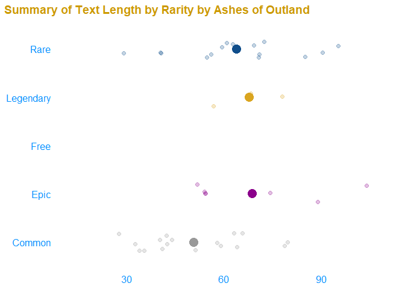

hearrthstone
================

PULL UP A CHAIR BY THE HEARTH\! Welcome to hearrthstone, the worlds
first ever (to my knowledge) R package that pulls data straight from the
Blizzard API for one of the most popular online card games in the world
today. For those of you that don’t know hearthstone is a card game
developed by the creators of World of Warcraft and set in the world of
Azeroth. The premise of the game is that heroes from the World of
Warcraft universe play in their spare time at the tavern. Using this
package you can explore how Hearthstone has changed over the last few
years. Which tribes have risen to popularity with new expansions? Which
classes have the best statted minions? What makes a legendary minion
different from regular rare and common minions? These questions and more
can be answered with the data you pull using the hearrthstone
package\!\!

To get started with the package we’re gonna need to install the
development version of the package from [Github](https://github.com/)
with:

## Installation

``` r
# install.packages("devtools")
devtools::install_github("kabhatia7/hearrthstone")
```

``` r
library(hearrthstone)
```

Unlike with other API packages, the user does not need to specify an API
key to access the package since the package automates these processes,
so after you install and load the package you’re all set to go\!

## GET cards

#### get\_all\_cards()

The hearrthstone package uses GET requests to the Blizzard API in order
to output tidy data frames for us to use for our analysis. There are 4
main get card functions. The first one, `get_all_cards()` simply returns
a data frame all cards in the game, with a the parameters class and mana
cost since those are the only two variables that remain constant across
every card in hearthstone.

``` r
cards <- get_all_cards() 
```

The `get_all_cards()` function with no arguments simply returns every
card in the game. So if you’re familiar with data wrangling you could
pull all the cards in the game then filter based on whatever criteria
you wish from there. However, there are other functions so that you
would not have to do any data filtering and hopefully get the subset of
cards you wish for immediately. Let’s go over those now\!

#### get\_minions

Minions are the most fun and interesting parts about Hearthstone, every
card is so unique and using the `get_minions()` function you can easily
query either all the minion cards in the game or set specific filters
such as what class the card belongs to, its attack, health, and mana
cost. See the documentation for extensive details on how to most
effectively call the data you need. There are functions simlar to this
for both weapons and spells. See `get_weapons()` & `get_spells()`

``` r
minions <- get_minions() 

minions %>% 
  head()
```

    ##                   Name MinionType         hero Rarity manaCost
    ## 1    Shadowhoof Slayer      Demon Demon Hunter   Free        1
    ## 2 Crimson Sigil Runner       <NA> Demon Hunter Common        1
    ## 3          Battlefiend      Demon Demon Hunter Common        1
    ## 4        Ur'zul Horror      Demon Demon Hunter Common        1
    ## 5    Sightless Watcher      Demon Demon Hunter   Free        2
    ## 6       Furious Felfin     Murloc Demon Hunter   Rare        2
    ##                 CardSet attack health
    ## 1                 Basic      2      1
    ## 2      Ashes of Outland      1      1
    ## 3 Demon Hunter Initiate      1      2
    ## 4 Demon Hunter Initiate      2      1
    ## 5                 Basic      3      2
    ## 6      Ashes of Outland      3      2
    ##                                                                                 text
    ## 1                         <b>Battlecry:</b> Give your hero +1&nbsp;Attack this turn.
    ## 2                                                       <b>Outcast:</b> Draw a card.
    ## 3                                           After your hero attacks, gain +1 Attack.
    ## 4                              <b>Deathrattle:</b> Add a 2/1 Lost Soul to your hand.
    ## 5          <b>Battlecry:</b> Look at 3 cards in your deck. Choose one to put on top.
    ## 6 <b>Battlecry:</b> If your hero attacked this turn, gain +1 Attack and <b>Rush</b>.
    ##   CardType Text_length
    ## 1   Minion          58
    ## 2   Minion          28
    ## 3   Minion          40
    ## 4   Minion          53
    ## 5   Minion          73
    ## 6   Minion          82

Now that we got the functions that get us data, lets go over some
functions that actually do something with it\!

Note: The functions above

### Plotting with hearrthstone

hearrthstone makes use of ggplot2 and a few add-on functions to provide
visual plots that will allow the user to make sense of and answer
questions that they may have using the API data.

#### Animated Plots

The `gganimate()` and `plotly()` package are both very powerful for data
visualization. The hearrthstone package makes use of both of them in
order to to articulate changes in cards over the many different
expansions in Hearthstone.

Lets go over the `plot_rarity_stats()` function that we went over in the
last section. If we pass the logical operator `TRUE` in the function
this outputs a nice gif that shows us which different traits have
shifted since the start of the game. You can pass a specific card type
and what you want to compare amongst the different rarities in this
case. The `plot_class_stats()` function follows very similar arguments
and returns a similar looking plot. Check out my shiny app linked at the
bottom to interact with the different plotting functions.

``` r
plot_rarity_stats(cards, comparison_var = "Text_length", cardType = "Spell", animate = TRUE)
```

    ## Warning: Ignoring unknown aesthetics: text

    ## Coordinate system already present. Adding new coordinate system, which will replace the existing one.

<!-- -->

Something to note about the plotting functions is that the first
argument is a data frame argument, so they are `%>%` friendly\! If you
leave the argument blank it will simply use the get data functions and
generate the data for you.

### Interactive Plots

Unfortunately, this document outputs in the an md format we can not
display the interactive plotly plots. Fortunately, I have developed a
Shiny application that allows a user to explore all of the plotly plots
that this package. Feel free to check them out below,

Now that you’ve seen how I explored the wonderful and dangerous world of
Hearthstone, its your turn\! Check out my shiny app linked
[here](https://kabhatia7.shinyapps.io/hearrthstone_exploration/) to use
the functions I built to explore any burning questions you may have
around the hearth\!
